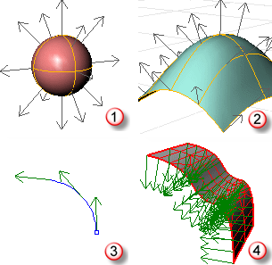
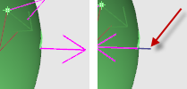
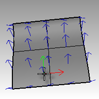
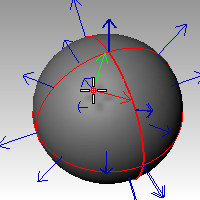

---
---

## Normal direction
{: #kanchor3163}
{: #normal-direction}
For curves, the direction is determined originally by the start and end points specified when it was drawn.
For surfaces the normal is a direction that points toward what you can think of as "outside" or "up." For closed polysurface (cone, cylinder, box, etc.) or single-surface solids (sphere, torus), the normal always points "out." However, on an open surface or polysurface, the direction of the normal depends on how it was created and can seem arbitrary. The Dir command displays an object's normal direction.

Solid (1), Surface (2), Curve (3), Mesh (4).
If the surface has been [flipped](dir.html#flip), a small blue line indicates the "natural" normal.

Normal surface (left), flipped surface with natural normal display (right).

## U and v&#160;directions
{: #kanchor3165}
{: #kanchor3164}
{: #uvdirections}
Every surface is roughly rectangular. Surfaces have three directions, u, v, and normal. You can display the u and v&#160;directions and the normal direction with the Dir command.
The u and v&#160;directions are like the weave of cloth or screen. The u-direction is indicated by the red arrow, and the v&#160;direction is indicated by the green arrow. The normal direction is indicated by the white arrow. You can think of u, v, and normal&#160;directions as corresponding to the x, y, and z of the surface.
These directions are used when [mapping textures](texturemapping.html) and [inserting knots](insertknot.html).

A circular surface can be like a spider web with one direction converging in the center.

 [Open topic with navigation](curvesurfacedirection.html) 

