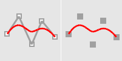
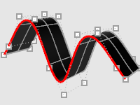

---
---

# CurveThroughSrfControlPt
{: #kanchor531}
{: #kanchor530}
{: #kanchor529}
 [Where can I find this command?](javascript:void(0);) Toolbars
 [Not on toolbars.](toolbarwhattodo.html) 
Menus
 [Not on menus.](menuwhattodo.html) 
The CurveThroughSrfControlPt command fits curves through the [control points](pointson.html) of a surface.
Steps
 [Select](select-objects.html) a surface.Select a point near a control point, as the desired control polygons are highlighted.The surface [control points](controlpoint.html) and control polygons will appear.Press [Enter](enter-key.html) to end the command.Your browser does not support the video tag.Command-line options
CurveType
ControlPoint
The curve's [control points](controlpoint.html) pass through the vertices, points, or control points.

Curve control points match input.

Resulting extruded surface.
Interpolated
The [curve](curve.html) passes through the vertices, points, or control points.

Curve matches input.

Resulting extruded surface.
The control point curve degree is 3 if there are 4 or more points on the surface, and less if there are fewer points.
Direction(Surfaces only)
Specify the u, v, or both [directions](curvesurfacedirection.html).
Toggle(Surfaces only)
Toggles the [direction](curvesurfacedirection.html) between u and v.
See also
 [Create curves from other objects](sak-curvefromobject.html) 
&#160;
&#160;
Rhinoceros 6 © 2010-2015 Robert McNeel &amp; Associates.11-Nov-2015
 [Open topic with navigation](curvethroughsrfcontrolpt.html) 

