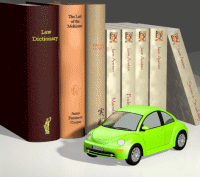
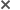
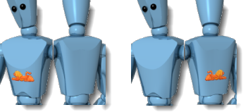
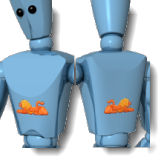
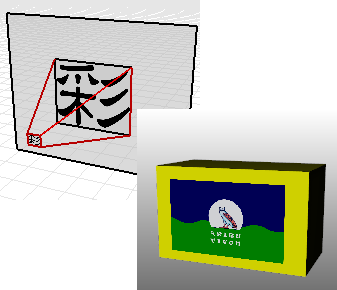
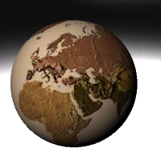
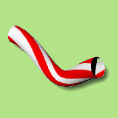
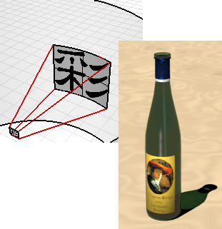
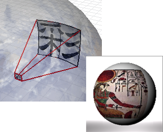
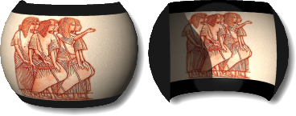

---
---

{: #kanchor2781}{: #kanchor2782}{: #kanchor2783}{: #kanchor2784}{: #kanchor2785}{: #kanchor2786}
# Decals
 [Where can I find this command?](javascript:void(0);) Toolbars
 [Popup](popup-toolbar.html)  [Properties](properties-toolbar.html)  [Standard](standard-toolbar.html) 
Menus
Edit and Panels
Object Properties
Shortcut
F3
TheDecalproperties manage object properties for the selected decals.

Decals are non-repeating textures that are applied to the surface of an object with a given projection. They are an easy-to-use way of attaching single images or similar textures to objects without going through the complexity of the texture mapping process.
Decals are textures that are placed directly on a specified area of one or more objects. Use decals to modify a limited part of an object's color.
Decals consist of a single instance of a texture, rather than being tiled as they are when used in a [material](material.html).
Some uses for decals include:
Hanging artwork on interior walls.Placing labels or logos on products.Adding signs to the model.Creating stained glass windows.Decal properties
Add
Places a new decal on the object.
Edit Placement
Turns on the decal widget to allow relocating and resizing the decal. The widget can be manipulated with Rhino commands such as [Move](move.html), [Rotate](rotate.html), [Scale](scale.html), and manipulated with the [Gumball](gumball.html) control.
Delete
Deletes the selected decal.
Move Down / Up
Drag decals up or down in the list to change the order they are displayed on the object.
When multiple overlapping decals are applied on a single object, the order in which they are applied may be significant. Decals are applied in the order they appear in the list. The last decal in the list appears to be on top.
XYZ Position
The location of the origin point of the decal.
Transparency
Determines the transparency of the selected decal. It works like a multiplier for the texture’s alpha channel.
Direction
Sets the direction of the decal projection.
Forward / Backward
Projects the decal away from the front or back of the decal texture.

Forward projection (left) and backward projection (right).
Both
Projects the decal away from both the front and the back of the decal texture.

Projection both directions.
Selected texture name
A preview of the texture is displayed in the preview area below.
Image preview pane
Displays the bitmap image.
Import from file
Imports bitmap images from a texture (.rtex) file or creates a new texture from an image.
New
Inserts a new decal image to the [Texture Palette](texturepalette.html).
Edit
Opens the [Bitmap Texture](texturepalette.html#bitmap) editor.
Duplicate
Creates a copy of the decal image in the [Texture Palette](texturepalette.html).
Decal Mapping Style options
The mapping style determines how to project the decal onto the object. It is a good idea to draw construction lines in the scene to help accurately place decals. Use object snaps for accurate placement.
Mapping style
Planar
UsePlanarmapping for mapping to flat or gently curved objects.
When using the planar mapping on a curved object, the entire texture must lie behind the surface of the object. Portions of the texture that lie in front of the surface will not be visible.

Planar decal.
To place a planar decal
The action for placing a planar decal is the same as the [Rectangle](rectangle.html) command. Drag a rectangle to define the planar mapping.Note
The rectangle is constrained to the aspect ratio of the texture.Press and hold the [Shift](shift-key.html) key to unlock the aspect ratio constraint.After the rectangle has been defined, the planar decal is created. The xyz position can be edited directly on the decal dialog or the position can be picked by clicking the pick button to the right of the xyz edit boxes.Planar decal properties
XYZ Position
The location of the starting corner of the decal.
UV decal properties
UseUVmapping for objects where the decal flows and stretches to fit the surface.
The decal covers the entire object, there is no control over the decal placement.
UV mapping uses the u and v [parameterization](parameterization.html) of the surface to bend and stretch the texture.

UV decals.
Cylindrical
UseCylindricalmapping for placing decals onto objects that curve in one direction, such as labels on wine bottles.
The cylindrical projection maps the texture onto the cylinder with the texture's vertical axis along the cylinder's axis, and the horizontal axis around the cylinder.

Cylindrical decal.
To place a cylindrical decal
The action for placing a cylindrical decal is the same as the [Cylinder](cylinder.html) command.Spherical
UseSphericalmapping for placing decals onto objects that curve in two directions. The spherical projection maps the texture onto the mapping sphere with the texture's vertical axis (height), curving from pole to pole, and the horizontal axis curving around the equator.

Spherical decal.
To place a spherical decal
The action for placing a spherical decal is the same as the [Sphere](sphere.html) command.For mapping objects completely covering a sphere, for example a globe, use the UV Mapping type.Map to inside
Maps the texture to the outside (convex) or inside of the sphere or cylinder with a thickness.

Outside (left), inside (right).

# Related commands

## RenderAddDecal
{: #kanchor2787}
 [Where can I find this command?](javascript:void(0);) Toolbars
 [Not on toolbars.](toolbarwhattodo.html) 
Menus
 [Not on menus.](menuwhattodo.html) 
TheRenderAddDecalcommand adds a decal to an object.
See also
 [Render](render.html) 
Render the objects using the current renderer.
 [Manage object properties](sak-objectproperties.html) 
 [Use materials and textures](sak-materialsandtextures.html) 
&#160;
&#160;
Rhinoceros 6 © 2010-2015 Robert McNeel &amp; Associates.11-Nov-2015
 [Open topic with navigation](decal.html) 

