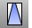
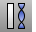

---
---

# Deformation Tools toolbar
{: #kanchor2393}
 [To open a toolbar](javascript:void(0);) Toolbars can be opened as a free-standing group or added to the current group.
To open a toolbar as a free-standing group
Click theOptionsicon in any toolbar group.On the menu, clickShow Toolbar, and then select the toolbar name from the list.To open a toolbar as a new tab in the current group
Click theOptionsicon in the toolbar group where you want to add the new tab.On the menu, clickShow or Hide Tabs, and then select the toolbar name from the list. [Bend](bend.html) 
Deform objects along an arc.
 [CageEdit](cageedit.html) 
Deform objects smoothly using control cage objects.
Link to [Cage toolbar](cage-toolbar.html) 
 [Cage](cage.html) 
Create a control cage object used by the [CageEdit](cageedit.html) command to deform other objects.
 [Flow](flow.html) 
Re-align objects from a base curve to a target curve.
 [FlowAlongSrf](flowalongsrf.html) 
Re-align objects from a source surface to a target surface.
 [Maelstrom](maelstrom.html) 
Deform objects in a spiral.
 [Splop](splop.html) 
Copy, rotate, scale, and wrap objects on a surface.
 [Stretch](stretch.html) 
Scale areas of an object in one direction.
 [Taper](taper.html) 
Deform objects toward or away from an axis.
 [Twist](twist.html) 
Deform objects by rotating portions around an axis.
&#160;
&#160;
Rhinoceros 6 © 2010-2015 Robert McNeel &amp; Associates.11-Nov-2015
 [Open topic with navigation](deformation-tools-toolbar.html) 

