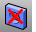

---
---

# DeleteHole
{: #kanchor545}
{: #kanchor544}
 [Where can I find this command?](javascript:void(0);) Toolbars
 [Solid Tools](solid-tools-toolbar.html)  [Holes](holes-toolbar.html) 
Menus
Solid
Solid Edit Tools
Holes
Delete Hole
&#160; [Crease splitting enabled](creasesplttingenabled.html) 
The DeleteHole command deletes a hole from a polysurface and remakes the surface.
Steps
 [Select](select-objects.html) a hole boundary.Command-line option
All
Deletes all holes.
See also
 [Create and edit holes in surfaces](sak-holes.html) 
&#160;
&#160;
Rhinoceros 6 © 2010-2015 Robert McNeel &amp; Associates.11-Nov-2015
 [Open topic with navigation](deletehole.html) 

