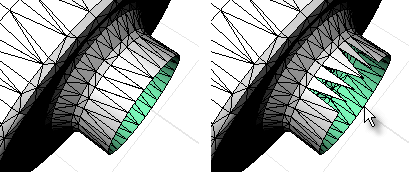

---
---

# DeleteMeshFaces
{: #kanchor548}
{: #kanchor547}
{: #kanchor546}
 [Where can I find this command?](javascript:void(0);) Toolbars
 [Mesh Tools](mesh-tools-toolbar.html) 
Menus
Mesh
Mesh Edit Tools
Delete Mesh Faces
The DeleteMeshFaces command removes selected mesh faces from the parent mesh creating a hole to help repair and close mesh files for rapid prototype printing.
The DeleteMeshFaces command is most effective in a shaded display mode since you can pick within a shaded mesh facet to select it.

Steps
 [Select](select-objects.html) mesh faces.Note
Some STL/SLA printers have problems if meshes contain many long, thin facets. These can slow the printer's slicing process down, produce odd printed results, and run the printer out of memory.The [MeshRepair](meshrepair.html) command may be useful when tuning up meshes for STL/SLA printing.See also
 [Edit mesh objects](sak-meshtools.html) 
 [White paper: Scan, Cleanup, Remodel](http://download.rhino3d.com/download.asp?id=ScanCleanupRemodel) 
&#160;
&#160;
Rhinoceros 6 © 2010-2015 Robert McNeel &amp; Associates.11-Nov-2015
 [Open topic with navigation](deletemeshfaces.html) 

