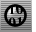
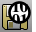
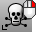

---
---

# Diagnostics toolbar
{: #kanchor2319}
 [To open a toolbar](javascript:void(0);) Toolbars can be opened as a free-standing group or added to the current group.
To open a toolbar as a free-standing group
Click theOptionsicon in any toolbar group.On the menu, clickShow Toolbar, and then select the toolbar name from the list.To open a toolbar as a new tab in the current group
Click theOptionsicon in the toolbar group where you want to add the new tab.On the menu, clickShow or Hide Tabs, and then select the toolbar name from the list. [Audit](audit.html) 
Check the active file for errors.
 [Audit3dmFile](audit.html#audit3dmfile) 
Check any Rhino model file for errors.
 [Check](check.html) 
Report errors in an object's data structure.
 [CheckNewObjects](check.html#checknewobjects) 
Report errors in an object's data structure as it is created or imported.
 [List](list.html) 
Report information about object's data structure.
 [What](what.html) 
Report object properties details.
 [Rescue3dmFile](rescue3dmfile.html) 
Recover data from damaged files.
 [SelBadObjects](selection-commands.html#selbadobjects) 
Select all objects that do not pass [Check](check.html).
 [ExtractBadSrf](extractbadsrf.html) 
Separate surfaces with errors from a polysurface.
&#160;
&#160;
Rhinoceros 6 © 2010-2015 Robert McNeel &amp; Associates.11-Nov-2015
 [Open topic with navigation](diagnostics-toolbar.html) 

