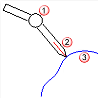

---
---

# Digitize
{: #kanchor560}
{: #kanchor559}
{: #kanchor558}
{: #kanchor557}
 [Where can I find this command?](javascript:void(0);) Toolbars
 [3&#8209;D_Digitizing](3-d-digitizing-toolbar.html)  [Tools](tools-toolbar.html) 
Menus
Tools
3-D Digitizer
Connect
The Digitize command connects and initializes a 3-D digitizing arm.
To start a 3-D digitizer
Select the name of your digitizing arm.Use the arm to pick an origin with digitizer in the real world.Use the arm to pick an x&#160;axis in the real world.Use the arm to pick a y&#160;axis with digitizer in the real world.You do not need to ensure that the y&#160;axis is perpendicular to the x&#160;axis, Rhino will do it for you.Pick the origin in Rhino.Press [Enter](enter-key.html) to use the world coordinate system.Pick the x&#160;axis in Rhino.Pick the y&#160;axis in Rhino.Using other commands with the digitizer
Whenever Rhino prompts you to choose a point, you can use the digitizer. Thus, all the commands on the curve menu work with the digitizer as input. You can draw lines, arcs, circles, and curves with the digitizer, just as if you were choosing the points with the mouse.
Bypassing the foot pedal
The [DigClick](#digclick) command simulates pushing the foot pedal, and is assigned to the F12 key. If it is more convenient, you can use the F12 key to pick points with the digitizer instead of using the foot pedal.
Digitizing large objects
The method for successfully digitizing large objects is similar leapfrogging from one portion of the object to the next, recording reference points as you go. The digitizer should always be able to reach at least two sets of reference points.
To set up reference points
Mark reference points on the object.Calibrate the digitizer with the table.Digitize the first two sets of reference points.Move the arm so you can reach the second and third sets.Calibrate the digitizer with the second set of reference points.Digitize the third set of reference points.Continue moving from one set of reference points to the next until all the reference points are digitized.Using a non-standard tip with the MicroScribe{: #kanchor561}
If you use the MicroScribe and Rhino with tips other than the standard tip that comes with the MicroScribe, you must edit the mstip.dat file and follow these instructions, which are also contained in the mstip.dat.
Set the MicroScribe to use a non-standard tip
A Standard Ball Tip is 0.242 inches shorter than standard point tip.Set D5Delta = 0.0 if using standard point tip.Set D5Delta = 0.242 if using standard ball tip.If you have a non-standard tip, measure the exact difference between the standard point tip and your tip (in inches) and type that number for D5Delta. If the tip is longer, make D5Delta negative; if the tip is shorter, make D5Delta positive.Be sure to power up the MicroScribe with the standard point tip in the home position (inserted in the stylus holder) before changing tips. Powering up the MicroScribe with anything other that the standard point tip will cause inaccuracies in the data Rhino reports.
Crash with the Faro Digitizer{: #kanchor562}{: #kanchor563}
In theFaro Hardware Setupdialog box, changing theTrigger ModefromInternal (normal)toExternalcauses Rhino to crash.
There is currently no fix for this problem.

# Related commands

## DigBeep
{: #kanchor564}
{: #digbeep}
 [Where can I find this command?](javascript:void(0);) Toolbars
 [Not on toolbars.](toolbarwhattodo.html) 
Menus
 [Not on menus.](menuwhattodo.html) 
The DigBeep command turns digitizer pedal sound feedback on and off.
Steps
Click an option to turn the beep on or off.
## DigCalibrate
{: #kanchor567}
{: #kanchor566}
{: #kanchor565}
{: #digcalibrate}
 [Where can I find this command?](javascript:void(0);) Toolbars
 [3-D_Digitizing](3-d-digitizing-toolbar.html) 
Menus
Tools
3-D Digitizer
Calibrate
The DigCalibrate command calibrates a 3-D digitizer.
Steps
Pick an origin on or near your physical model that will be the origin of the digitizer coordinate system.Pick an x&#160;axis on or near your physical model that is on the x&#160;axis of the digitizer coordinate system.Pick a y&#160;axis on or near your physical model that is on the y&#160;axis of the digitizer coordinate system.Rhino will automatically make the y&#160;axis orthogonal to the x&#160;axis in the plane of the three points you pick, so the y&#160;axis point in the digitizer coordinate system need not be orthogonal to the x&#160;axis.Pick an origin point in Rhino that corresponds to the origin of the digitizer coordinate system.Press [Enter](enter-key.html) if you want the origin of the digitizer coordinate system to correspond to the world coordinate system in Rhino.Pick an x&#160;axis in Rhino that corresponds to the x&#160;axis of the digitizer coordinate system.Pick a y&#160;axis in Rhino that corresponds to the y&#160;axis of the digitizer coordinate system.
## A Method for Repeatable Calibration
It is often necessary to recalibrate the digitizer so that Rhino is in synch with the real world. Sometimes the digitizer gets bumped, or the object moves slightly, or you needed to close Rhino in the middle of the digitizing session. Whatever the reason, it is useful to set up reference points to allow recalibration of the digitizer.
Overview
Clamp the arm and the object to digitize to the table.Calibrate the digitizer to properly orient the real object inside Rhino.Mark three reference points on the real object that will be used to recalibrate the digitizer.Digitize the three reference points in Rhino.Whenever you need to recalibrate the digitizer, use the three reference points on the real object and the three corresponding points in Rhino.The first calibration
Use the arm to pick an origin on the table.Use the arm to pick an x&#160;axis on the table.Use the arm to pick a y&#160;axis on the table.Press [Enter](enter-key.html) to map the origin to the world coordinate system.Create reference points
Mark three points on the real object with a permanent pen.Label each pointO,X, andYfor the origin, x, and y&#160;axes.Start the [Polyline](polyline.html) command.Draw a polyline fromXtoOtoY. This is the reference polyline.It may be useful to move this polyline to a layer called "reference points" for later use.Use the [Dot](dot.html) command to label the endpoints and vertex of the polylineX,Y, andO.If the digitizer or object moves, or you need to close and restart Rhino, you will need to recalibrate the digitizer so the new data lines up with the existing data.Recalibrate the digitizer
Use the arm to pick origin pointOon the real object.Use the arm to pick x&#160;axis pointXon the real object.Use the arm to pick y&#160;axis pointYon the real object.In Rhino, snap to the vertex of the reference polyline labeledOto map origin.In Rhino, snap to the endpoint of the reference polyline labeledXto choose the x&#160;axis.In Rhino, snap to the endpoint of the reference polyline labeledYto choose the y&#160;axis.
## DigCamera
{: #kanchor568}
{: #digcamera}
 [Where can I find this command?](javascript:void(0);) Toolbars
 [Not on toolbars.](toolbarwhattodo.html) 
Menus
 [Not on menus.](menuwhattodo.html) 
The DigCamera command sets the current viewport camera location and direction based on the digitizer probe position and direction - I, J, K coordinates.
Command-line option
Tolerance
The distance the probe must move to initiate a view change.

## DigClick
{: #kanchor570}
{: #kanchor569}
{: #digclick}
 [Where can I find this command?](javascript:void(0);) Toolbars
 [3-D Digitizing](3-d-digitizing-toolbar.html) 
Menus
 [Not on menus.](menuwhattodo.html) 
Shortcut
F12
TheDigClickcommand lets you pick points from within Rhino instead of using the digitizer's foot pedal to pick points.
Steps
Set up a [function key](keyboard.html) (such as F12) with the DigClick command, so when you press the function key, it is as if you pressed the foot pedal.
## DigDisconnect
{: #kanchor573}
{: #kanchor572}
{: #kanchor571}
{: #digdisconnect}
 [Where can I find this command?](javascript:void(0);) Toolbars
 [3-D_Digitizing](3-d-digitizing-toolbar.html)  [Tools](tools-toolbar.html) 
Menus
Tools
3-D Digitizer
Disconnect
The DigDisconnect command disconnects the 3-D digitizer.

## DigLine
{: #kanchor574}
{: #digline}
 [Where can I find this command?](javascript:void(0);) Toolbars
 [3-D Digitizing toolbar](3-d-digitizing-toolbar.html) 
Menus
Tools
3-D Digitizer
Normal Line
The DigLine command digitizes a line that starts at the probe point and points away from the digitized surface.
Probe (1), Line (2), Object (3).
Steps
 [Pick](pick-location.html) a start for the line with the digitizer.A line is drawn with the start of the line at the probe tip in a direction opposite the probe direction vector.Command-line option
Length
Specifies the length of the line.

## DigPause
{: #kanchor577}
{: #kanchor576}
{: #kanchor575}
{: #digpause}
 [Where can I find this command?](javascript:void(0);) Toolbars
 [3-D_Digitizing](3-d-digitizing-toolbar.html) 
Menus
Tools
3-D Digitizer
Pause
The DigPause command pauses the 3-D digitizer so that it does not interfere with using the mouse.

## DigScale
{: #kanchor580}
{: #kanchor579}
{: #kanchor578}
{: #digscale}
 [Where can I find this command?](javascript:void(0);) Toolbars
 [3-D_Digitizing](3-d-digitizing-toolbar.html) 
Menus
Tools
3-D Digitizer
Set Scale
The DigScale command sets the scale factor for digitized points.
Steps
Type the scale factor for all digitized input.To digitize in meters, type 0.0254.To digitize in centimeters, type 2.54.To digitize in millimeters, type 25.4.
## DigSection
{: #kanchor583}
{: #kanchor582}
{: #kanchor581}
{: #digsection}
 [Where can I find this command?](javascript:void(0);) Toolbars
 [3-D_Digitizing](3-d-digitizing-toolbar.html) 
Menus
Tools
3-D Digitizer
Planar Section Curve
The DigSection command creates planar cross sections using the 3-D digitizer.
Steps
Draw the base plane.See the [Rectangle](rectangle.html) command for option descriptions.The base plane defines the plane to which all sections will be parallel. Multiple digitizing planes defined for quick sectioning of your object. Every time the arm passes through one of the digitizing planes, Rhino samples a point object.The planes are defined with a base point, direction, and spacing. The planes are perpendicular to the line between the base point and the direction point.Pick the start of the section plane axis.The first section plane will pass through the start of the axis.Specify the end of axis and spacing.You can either space the planes at intervals or space the planes evenly between the axes' start and end.Touch your object with the arm and push and hold the pedal.As long as you depress the pedal, Rhino will sample points while the arm crosses over one of the section planes. Releasing the pedal prevents Rhino from sampling points, so you move the digitizer without keeping it on the object. Depress the pedal again to continue sampling points.Press [Enter](enter-key.html) when you are finished.When you finish digitizing points on the object, a planar curve is created in each digitizing plane. The points are still selected, so you can move them to another layer or delete them.Command-line options
ConstuctionPlaneArrangement
EvenlySpaced
NumberOfPlanes= *&lt;value&gt;* 
SeparationDistance
DistanceBetweenPlanes= *&lt;value&gt;* 
PointSpacing
Sets the minimum spacing between points.
Points
Creates points as you sketch.
Curve
Creates a curve as you sketch.
Polyline
Creates a polyline as you sketch.

## DigSketch
{: #kanchor586}
{: #kanchor585}
{: #kanchor584}
{: #digsketch}
 [Where can I find this command?](javascript:void(0);) Toolbars
 [3-D_Digitizing](3-d-digitizing-toolbar.html) 
Menus
Tools
3-D Digitizer
Sketch Curve
The DigSketch command sketches a curve using a 3-D digitizer.
Steps
Move the arm to the location where you want to start digitizing,push and hold the pedal, and drag the arm through the curve to digitize.To create a closed curve, typeCwhen creating a curve.Command-line options
Points
Draws points as you sketch.
Curve
Draws a curve as you sketch.
Planar
Draws objects in one plane as you sketch.
Polyline
Draws a polyline as you sketch.
PointSpacing
Sets the minimum spacing between points.
See also
 [Use a digitizing arm](sak-3ddigitizing.html) 
&#160;
&#160;
Rhinoceros 6 © 2010-2015 Robert McNeel &amp; Associates.11-Nov-2015
 [Open topic with navigation](digitize.html) 

