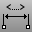

---
---

# DimAngle
{: #kanchor595}
{: #kanchor594}
{: #kanchor593}
 [Where can I find this command?](javascript:void(0);) Toolbars
 [Dimension](dimension-toolbar.html)  [Drafting](drafting-toolbar.html) 
Menus
Dimension
Angle Dimension
 [&#160;History enabled](historyenabled.html) 
The DimAngle command dimensions the angle of an arc, or between two selected lines, or from three points.
Steps
 [Select](select-objects.html) an arc.OrSelect two lines, polyline segments, linear surface or polysurface edges. [Pick](pick-location.html) the dimension location.Command-line options
Style
Enter the [dimension style](dimensions.html) name.
Points
Pick the apex of the angle and then the dimension points.
Your browser does not support the video tag.See also
 [Dimension Properties](dimension.html) 
Manage angle brackets, dimension display, degree, diameter, plus/minus symbols.
 [Use text and dimensions for annotation](sak-textanddimensions.html) 
&#160;
&#160;
Rhinoceros 6 © 2010-2015 Robert McNeel &amp; Associates.11-Nov-2015
 [Open topic with navigation](dimangle.html) 

