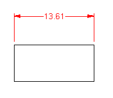

---
---

{: #kanchor1172}{: #kanchor1173}{: #kanchor1174}{: #kanchor1175}{: #kanchor1176}{: #kanchor1177}{: #kanchor1178}{: #kanchor1179}{: #kanchor1180}{: #kanchor1181}{: #kanchor1182}{: #kanchor1183}
# Dimension Styles
 [Where can I find this command?](javascript:void(0);) Toolbars
 [File](file-toolbar.html)  [Properties](properties-toolbar.html)  [Standard](standard-toolbar.html) 
Menus
File
Properties
TheDimension Styleproperties manage the default dimension style for the current model.
Name
Dimension style name.
{: #font}Font
Dimension text font.
Number format
Decimal
1.25
Fractional
1-1/4
Feet &amp; inches
1'-3"
Precision
The number of decimal places for the distance display.
Angle precision
The number of decimal places for the angle display.
Angle format
Degrees
Decimal degrees.
D M S
Degrees, minutes, seconds.
Layout sizes
Text and item sizes in document [units](units.html).
{: #text-height}Text height
Sets the text height.
{: #text-gap}Text gap
The size of the gap between the text and the dimension line and the size of the [Mask](dimensions.html#mask) margin.
Masks in dimensions are half the size of text masks that use the same value.
Extension line extension
Length of the extension line above the dimension line.
Extension line offset
The distance from the dimension point on the object to the start of the extension line.
Dimension line extension
The distance the dimension line is extended past the extension lines (generally used with ticks).
Center mark size
The size of the center mark for radius and diameter dimensions.
 *Arrow length (1), Extension line extension (2), Extension line offset (3).* 
{: #model-space-scale}Model space scale
The display size is a product of the component's size (like arrow size or text height) and theModel space scalevalue.
Normally this is the inverse of the * [print scale](print.html) *. The text height, extension line extension, extension line offset distance, and arrow length are multiplied by this number.
 **Scale distances** 
Scales all dimension distances at once.
Suppress extension line 1
Suppress extension line 2
Dimension arrows
Length
The length of the dimension arrow.
Arrow style
Arrow
Dot
Tick
Short arrow
Open arrow
Rectangle
Long arrow
Longer arrow
Leader arrows
Length
The length of the leader arrow.
Arrow style
Arrow
Dot
Tick
Short arrow
Open arrow
Rectangle
Long arrow
Longer arrow
Text alignment
Above dimension line
Places text above the dimension line. Rotates the text to align with the dimension line.

In dimension line
Cuts the dimension line and centers the text inside it.

Horizontal to view
Draws the text horizontal to the view, regardless of the direction of the dimension line.

Primary text
Length factor
The conversion factor between Rhino units and dimension units.
Prefix
Text to prefix to the dimension text.
Suffix
Text to append to the dimension text.
Alternate text
Displays a different unit system in addition to the primary text.
Use alternate text
Turns on the alternate unit system
Number format
Units system for the alternate dimensions.
Decimal
(1.25)
Fractional
(1-1/4)
Feet &amp; inches
(1'-3")
Length factor
The conversion factor between Rhino units and alternate units.
Precision
Number of decimal places to display.
Prefix
Text to prefix to the dimension text.
Suffix
Text to append to the dimension text.
Tolerances
Appends tolerances to dimension text. The tolerance is the amount that a dimensioned distance can vary.
The tolerance displays the degree of accuracy required to manufacture a certain feature or part.
Style
Controls how the tolerance is formatted or displayed on the dimension line.
None
No tolerance is added.
Symmetrical
Adds a±(plus/minus) character and singleUpper value.

Deviation
Displays theUpper valuepreceded by a + (plus) character and theLower valuepreceded by a - (minus) character on the dimension line.

Limits
The dimension displays the dimension length plus theUpper valueand the dimension length minus theLower value.

Precision
Sets the number of decimal places used in calculating the tolerance.
Upper value
Sets the maximum or upper tolerance value.
Lower value
Sets the minimum or lower tolerance value.
{: #mask}Mask
For [dimensions](dim.html) and [leaders](leader.html), the [Text gap](#text-gap) setting controls the margin.
Show mask
Surrounds text with an opaque color.

Background color
Sets the mask color to the viewport [background color](appearance-colors.html#backgroundcolor).

Color
Select the mask color using the [Select Color](select-color.html) dialog box.
 **Preview** 
Temporarily changes dimensions that use this style to reflect the new settings.

# Related commands

## DupDimStyle
{: #kanchor1184}
{: #dupdimstyle}
 [Where can I find this command?](javascript:void(0);) Toolbars
 [Not on toolbars.](toolbarwhattodo.html) 
Menus
 [Not on menus.](menuwhattodo.html) 
The DupDimStyle command creates new dimension styles by copying existing styles.
Duplicate Dimension Style
Select dimension style to copy
Lists dimension styles that exist in the model. Select a style to use as a template.
New dimension style
Specifies the name for the new style.
Set current
Makes the new dimension style the current style.

## ImportDimStyles
{: #kanchor1185}
{: #importdimstyles}
 [Where can I find this command?](javascript:void(0);) Toolbars
 [Dimension](dimension-toolbar.html) 
Menus
 [Not on menus.](menuwhattodo.html) 
The ImportDimStyles command imports dimension styles from .3dm files into the current document.

## ScaleDimStyle
{: #kanchor1186}
{: #scaledimstyle}
 [Where can I find this command?](javascript:void(0);) Toolbars
 [Drafting](drafting-toolbar.html)  [Dimension](dimension-toolbar.html) 
Menus
 [Not on menus.](menuwhattodo.html) 
The ScaleDimStyle command scales all of the distances in a dimension scale at once.

## SetCurrentDimStyle
{: #kanchor1187}
{: #setcurrentdimstyle}
 [Where can I find this command?](javascript:void(0);) Toolbars
 [Dimension](dimension-toolbar.html) 
Menus
Dimension
Set Current Dimension Style
The SetCurrentDimStyle command specifies the current dimension style.
See also
 [Use drafting tools](sak-drafting.html) 
 [Manage document properties](sak-documentproperties.html) 
 [Use text and dimensions for annotation](sak-textanddimensions.html) 
&#160;
&#160;
Rhinoceros 6 © 2010-2015 Robert McNeel &amp; Associates.11-Nov-2015
 [Open topic with navigation](dimensions-style.html) 

