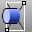
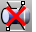
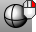
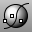

---
---

# Display toolbar
{: #kanchor2321}
 [To open a toolbar](javascript:void(0);) Toolbars can be opened as a free-standing group or added to the current group.
To open a toolbar as a free-standing group
Click theOptionsicon in any toolbar group.On the menu, clickShow Toolbar, and then select the toolbar name from the list.To open a toolbar as a new tab in the current group
Click theOptionsicon in the toolbar group where you want to add the new tab.On the menu, clickShow or Hide Tabs, and then select the toolbar name from the list. [Artistic display mode](view-displaymode-options.html#artistic) 
Uses an image background and soft lines to create a pencil drawing effect.
 [Set all viewports to Artistic display mode](view-displaymode-options.html#artistic) 
Sets all viewports to Artistic mode.
 [ClippingPlane](clippingplane.html) 
Create a plane that hides objects.
 [DisableClippingPlane](clippingplane.html#disableclippingplane) 
Turn off the selected clipping plane.
 [EnableClippingPlane](clippingplane.html#enableclippingplane) 
Turn on selected clipping planes in the active viewport.
 [FlatShade](flatshade.html) 
Shade objects without smoothing between mesh faces.
 [Ghosted viewport display mode](view-displaymode-options.html#ghosted) 
Shade objects so surfaces are translucent.
 [Set all viewports to Ghosted display mode](view-displaymode-options.html#ghosted) 
Sets all viewport displays to Ghosted mode.
 [Mesh document properties](mesh.html) 
Manage the display/render mesh settings for the current model.
 [Pen display mode](view-displaymode-options.html#pen) 
Uses white with black lines to simulate a pen drawing.
 [Set all viewports to Pen display mode](view-displaymode-options.html#pen) 
Sets all viewports to Pen mode.
 [Rendered viewport display mode](view-displaymode-options.html#rendered) 
Shade objects with a simulation of the rendered view.
 [Set all viewports to Rendered display mode](view-displaymode-options.html#rendered) 
Sets all viewport displays to Rendered mode.
 [SetObjectDisplayMode](setobjectdisplaymode.html) 
Assign separate display attributes to objects, overriding viewport settings.
 [Shade](shade.html) 
Temporarily shade the current viewport.
 [Shade, *All* ](shade.html) 
Temporarily shade all viewports.
 [Shaded viewport display mode](view-displaymode-options.html#shaded) 
Set the viewport to opaque shaded mode.
 [Set all viewports to Shaded display mode](view-displaymode-options.html#shaded) 
Sets all viewport displays to shaded mode.
 [ShadeSelected](shade.html#shadeselected) 
Shade selected objects only.
 [Technical display mode](view-displaymode-options.html#technical) 
Uses real-time silhouettes and intersections, creases, borders, blended shaded and rendered display. Objects behind other objects are occluded.
 [Set all viewports to Technical display mode](view-displaymode-options.html#technical) 
Sets all viewports to Technical mode.
 [Toggle display panel](displayproperties.html) 
Opens and closes the Display Panel.
 [ViewCaptureToFile](viewcapture.html#viewcapturetofile) 
Save an image of the current view to a file.
 [ViewCaptureToClipboard](viewcapture.html#viewcapturetoclipboard) 
Save an image of the current view to the Clipboard.
 [Wireframe viewport display mode](view-displaymode-options.html#wireframe) 
Set the viewport display to unshaded wireframe.
 [Set all viewports to Wireframe display mode](view-displaymode-options.html#wireframe) 
Sets all viewport displays to unshaded wireframe.
 [X-Ray viewport display mode](view-displaymode-options.html#x-ray) 
Shade with unobscured [isoparametric curves](isocurve.html).
 [Set all viewports to X-Ray display mode](view-displaymode-options.html#x-ray) 
Sets all viewport displays to X-Ray mode.
&#160;
&#160;
Rhinoceros 6 © 2010-2015 Robert McNeel &amp; Associates.11-Nov-2015
 [Open topic with navigation](display-toolbar.html) 

