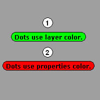
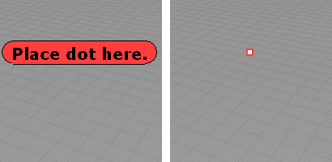

---
---

# Dot
{: #kanchor443}
{: #kanchor442}
{: #kanchor441}
{: #kanchor440}
 [Where can I find this command?](javascript:void(0);) Toolbars
 [Annotate](annotate-toolbar.html)  [Dimension](dimension-toolbar.html)  [Drafting](drafting-toolbar.html) 
Menus
Dimension
Annotation Dot
The Dot command draws an annotation dot that stays parallel to and sizes with the view.

Steps
Type the text to display in the dot. [Pick](pick-location.html) the dot location.Note
The background color for dots is determined either by the [layer](layer.html) or object [properties](properties.html) colors.Double-click the dot to edit the text.Use [Dot Properties](#dot-properties) to change the text, font, or height.Dots can be more than one line.Dot Options
Font
Set the dot font.
Height
Set the text height.
Display text
The text that displays in the dot.
{: #secondary-text}Secondary text
Extra information that the dot object can hold.
{: #dot-properties}Dot Properties
Manages object [properties](properties.html) for the selected dots.
Font
Set the dot font.
Height
Set the text height.
Display text
The text that displays in the dot.
Secondary text
Extra information that the dot object can hold.

# ConvertDots
{: #convertdots}
 [Where can I find this command?](javascript:void(0);) Toolbars
 [Not on toolbars.](toolbarwhattodo.html) 
Menus
 [Not on menus.](menuwhattodo.html) 
TheConvertDotscommand converts [Dot](#) objects to either point or text objects.
Steps
 [Select](select-objects.html) text dots to convert.Command-line options
DeleteInput
Yes
Deletes the original geometry.
No
Retains the original geometry.
Output
The output is at the location of the original dot object.
Point
Converts the dot to a [point](point.html) object.

Original dot (left) and dot converted to a point object (right).
Text
Converts the dot to annotation [text](text.html).

Original dot (left) and dot converted to text (right).
Text options
Sets the properties for the resulting text.
TextHeight
The text height in model [units](units.html).
HorizontalAlign
TheLeft/Center/Rightjustification.
VerticalAlign
TheBottom/Middle/Topjustification.
See also
 [Use text and dimensions for annotation](sak-textanddimensions.html) 
&#160;
&#160;
Rhinoceros 6 © 2010-2015 Robert McNeel &amp; Associates.11-Nov-2015
 [Open topic with navigation](dot.html) 

