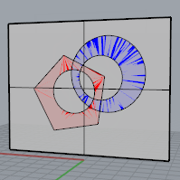
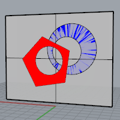
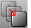
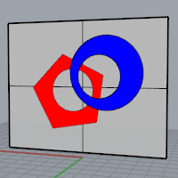
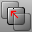
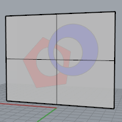

---
---

# Draw Order
{: #kanchor223}
{: #kanchor222}
{: #kanchor221}
{: #kanchor220}
{: #kanchor219}
{: #kanchor218}
{: #kanchor217}
{: #kanchor216}
Draw order defines how coincidental or overlapping objects are displayed.
Currently it supports hatches, curves, points, annotation (all forms of text other than dots), and details.
In the illustrations, the objects are displayed in [Ghosted Viewport](view-displaymode-options.html#ghosted) mode. The gray surface is on the same plane as the red hatch and the blue hatch. The surface appears to be blended with the hatches.

Default draw order.
Note
Objects within blocks maintain and display the draw order set before the block was created. When two blocks overlap, the one moved to display above the other will mask the block below.Selected objects draw on top.New objects are not given a draw order by default.Surfaces and meshes are not supported for draw order calculations; however, supported objects can be brought forward to display in front of a [Picture](picture.html) object.A set of objects in both the layout space and in the model viewport cannot be controlled with draw order. Draw order is restricted to modifying the display of objects in the same space.
# Draw order commands

## BringForward
{: #kanchor224}
{: #bringforward}
 [Where can I find this command?](javascript:void(0);) Toolbars
 [Draw Order](draw-order-toolbar.html) 
Menus
Edit
Arrange
Bring Forward
The BringForward command displays selected objects ahead of other objects in the display order.
In the illustration,BringForwardwas applied to the red hatch.
The red hatch draws on top of the blue hatch and the gray surface.

## BringToFront
{: #kanchor226}
{: #kanchor225}
{: #bringtofront}
 [Where can I find this command?](javascript:void(0);) Toolbars
 [Draw Order](draw-order-toolbar.html) 
Menus
Edit
Arrange
Bring to Front
The BringToFront command selected objects are moved to the front of the object display order.
In the illustration,BringToFrontwas applied to the blue hatch.

## SendBackward
{: #kanchor227}
{: #sendbackward}
 [Where can I find this command?](javascript:void(0);) Toolbars
 [Draw Order](draw-order-toolbar.html) 
Menus
Edit
Arrange
Send Backward
The SendBackward command moves selected objects back in the display order.
In the illustration, SendBackward was applied to both the blue and red hatches.
The surface draws on top of the two hatches.

## SendToBack
{: #kanchor228}
{: #sendtoback}
 [Where can I find this command?](javascript:void(0);) Toolbars
 [Draw Order](draw-order-toolbar.html) 
Menus
Edit
Arrange
Send to Back
The SendToBack command moves the selected objects to the back of the object display order.

## ClearDrawOrder
{: #kanchor229}
{: #cleardraworder}
 [Where can I find this command?](javascript:void(0);) Toolbars
 [Draw Order](draw-order-toolbar.html) 
Menus
Edit
Arrange
Clear Draw Order
The ClearDrawOrder command removes the draw order tag from selected objects. The objects now draw in their original order.
See also
 [Use drafting tools](sak-drafting.html) 
&#160;
&#160;
Rhinoceros 6 © 2010-2015 Robert McNeel &amp; Associates.11-Nov-2015
 [Open topic with navigation](draworder.html) 

