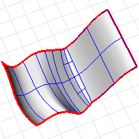

---
---

# DupBorder
{: #kanchor802}
{: #kanchor801}
{: #kanchor800}
 [Where can I find this command?](javascript:void(0);) Toolbars
 [Curve From Object](curve-from-object-toolbar.html) 
Menus
Curve
Curve From Objects
Duplicate Border
The DupBorder command creates a curve or polyline that duplicates the border of an open surface, polysurface, hatch, or mesh.

Steps
 [Select](select-objects.html) open objects.The border curves or polylines of the selected objects are created as separate curves.Command-line options
OutputLayer
Specifies the layer for the results of the command.
Current
Places the results on the current layer.
Input
Places the results on the same layer as the input curve.
TargetObject
Places the results on the same layer as the target surface.
See also
 [Create curves from other objects](sak-curvefromobject.html) 
&#160;
&#160;
Rhinoceros 6 © 2010-2015 Robert McNeel &amp; Associates.11-Nov-2015
 [Open topic with navigation](dupborder.html) 

