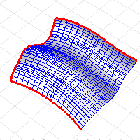

---
---

# DupMeshEdge
{: #kanchor815}
{: #kanchor814}
{: #kanchor813}
 [Where can I find this command?](javascript:void(0);) Toolbars
 [Curve From Object](curve-from-object-toolbar.html) 
Menus
Curve
Curve From Objects
Duplicate Mesh Edge
The DupMeshEdge command creates a polyline that duplicates the edge of a mesh.
Steps
 [Select](select-objects.html) a mesh edge.Command-line options
BreakAngle
TheBreakAngleoption specifies the angle in degrees under which mesh faces will be considered one object.
All
Polylines
ThePolylinesoption attempts to combine the unwelded and naked edges into logical polylines. It works best on meshes where the choices are obvious and where three or more candidate edges meet at a vertex.
Lines
TheLinesoption works fast, but it adds each edge as an individual line curve. These can be joined later.

See also
 [Create curves from other objects](sak-curvefromobject.html) 
 [Copy and duplicate objects](sak-copyandduplicate.html) 
 [Edit mesh objects](sak-meshtools.html) 
&#160;
&#160;
Rhinoceros 6 © 2010-2015 Robert McNeel &amp; Associates.11-Nov-2015
 [Open topic with navigation](dupmeshedge.html) 

