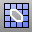

---
---

# DupMeshHoleBoundary
{: #kanchor818}
{: #kanchor817}
{: #kanchor816}
 [Where can I find this command?](javascript:void(0);) Toolbars
 [Mesh Tools](mesh-tools-toolbar.html) 
Menus
Mesh
Mesh Edit Tools
Extract
Hole Boundary
The DupMeshHoleBoundary command creates a polyline that duplicates the boundary of a mesh hole.

Steps
 [Select](select-objects.html) the mesh hole boundary.See also
 [Copy and duplicate objects](sak-copyandduplicate.html) 
&#160;
&#160;
Rhinoceros 6 © 2010-2015 Robert McNeel &amp; Associates.11-Nov-2015
 [Open topic with navigation](dupmeshholeboundary.html) 

