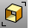

---
---

# Edge Tools toolbar
{: #kanchor2325}
 [To open a toolbar](javascript:void(0);) Toolbars can be opened as a free-standing group or added to the current group.
To open a toolbar as a free-standing group
Click theOptionsicon in any toolbar group.On the menu, clickShow Toolbar, and then select the toolbar name from the list.To open a toolbar as a new tab in the current group
Click theOptionsicon in the toolbar group where you want to add the new tab.On the menu, clickShow or Hide Tabs, and then select the toolbar name from the list. [JoinEdge](joinedge.html) 
Join two naked edges that are out of tolerance.
 [MergeEdge](mergeedge.html) 
Combine adjacent edges of the same surface.
 [MergeAllEdges](mergealledges.html) 
Merge all possible edges of a surface or polysurface.
 [RebuildEdges](rebuildedges.html) 
Restore surface edges to their surface.
 [SelOpenPolysrf](selection-commands.html#selopenpolysrf) 
Select all open polysurfaces.
 [ShowEdges](showedges.html) 
Highlight edges of surfaces and polysurfaces. Displays the Edge Analysis control.
 [ShowEdgesOff](showedges.html#showedgesoff) 
Turn off edge display.
 [SplitEdge](splitedge.html) 
Divide a surface edge.
 [MergeEdge](mergeedge.html) 
Combine adjacent edges of the same surface.
 [ZoomNaked.All](zoomnaked.html) 
Zoom all naked edges.
 [ZoomNaked](zoomnaked.html) 
Zoom to current naked edge.
 [ZoomNaked,Mark](zoomnaked.html) 
Find and mark naked edges.
 [ZoomNaked,Next](zoomnaked.html) 
Zoom to next naked edge.
 [ZoomNaked,Previous](zoomnaked.html) 
Zoom to previous naked edge.
&#160;
&#160;
Rhinoceros 6 © 2010-2015 Robert McNeel &amp; Associates.11-Nov-2015
 [Open topic with navigation](edge-tools-toolbar.html) 

