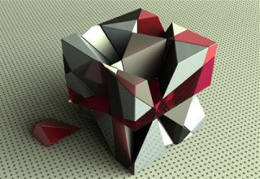
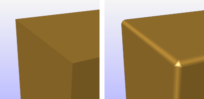
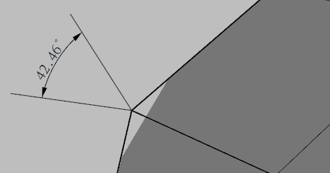

---
---

# Edge softening
{: #kanchor2804}
 [Where can I find this command?](javascript:void(0);) Toolbars
 [Popup](popup-toolbar.html)  [Properties](properties-toolbar.html)  [Standard](standard-toolbar.html) 
Menus
Edit and Panels
Object Properties
Shortcut
F3
Edge softening constructs an edge-softening display mesh for surfaces, polysurfaces, or meshes.

Note
Edge softening applies a mesh radius or chamfer to edges in the model.Edge Softening appears as a property for the surface.Surfaces inside [blocks](block.html) cannot be selected.Steps
 [Select objects](selection-commands.html#select-object-basics) to apply edge softening to.In the **Properties** panel, click theEdge Softeningbutton.Specify the edge softening properties.
Box object (left) and box with edge softening applied (right).
Edge softening properties
Manages surface edge softening [properties](properties.html) for the selected objects.
{: #on}On
Enables edges softening.
Settings
Softening
Specifies a softening amount. The visual radius approximation depends on the density of the underlying mesh.
Chamfer
The edge will be cut straight across with a hard edged chamfer. No attempt is made to soften this into a rounded edge.
Faceted
The object, including the edge softening effect will be shaded as faceted as in [FlatShade](flatshade.html).
Edge Threshold (degrees) ____
Softens the edge when the angle between the normal directions of two adjacent faces is greater than this setting.
In the example below, the edge will be softened only if Edge threshold is smaller than 42.46°.

Force Softening
Forces the softening in cases where too large a softening radius might prevent softening to take place.
See also
 [Use materials and textures](sak-materialsandtextures.html) 
&#160;
&#160;
Rhinoceros 6 © 2010-2015 Robert McNeel &amp; Associates.11-Nov-2015
 [Open topic with navigation](edgesoftening.html) 

