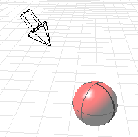
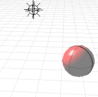
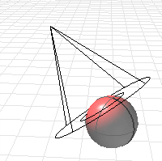
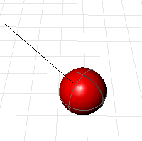

---
---

# EditLightByHighlight
{: #kanchor193}
 [Where can I find this command?](javascript:void(0);) Toolbars
 [Lights](lights-toolbar.html)  [Render](render-tools-toolbar.html)  [Tools](render-tools-toolbar.html) 
Menus
Render
Edit Light by Highlight
The EditLightByHighlight command edits a light by placing the light highlight on an object.
This command is view dependent. The light is placed so that the highlight is at the pick location on the object for the view in which it is placed- any changes to the view will change the location of the highlight. For best results use this command in combination with [saved views](namedview.html).
Steps
 [Select](select-objects.html) a light.Use [Rendered](view-displaymode-options.html#rendered) mode to see the effect of the light on the object.Select a surface or polysurface for the light to shine on. [Pick](pick-location.html) a location on the selected object that the light will hit.The light will be directed toward the surface at the selected spot.Your browser does not support the video tag.To place and direct a new light or helper line
Press [Enter](enter-key.html). [Specify a command line option.](specifycommandlineoption.html) Command-line options
NewLight
Creates a new light with the current view characteristics instead of modifying an existing light.
Type
Specifies the type of light.
DirectionalLight
Places and directs a [directional light](directionallight.html).

PointLight
Places and directs a [point light](pointlight.html#pointlight).

Spotlight
Places and directs a [spotlight](spotlight.html#top).

Line
Places a helper line segment normal to the surface. Helper lines are useful for placing objects that show in reflections when the scene is raytraced.

Color
Click the option to open the [Select Color](select-color.html) dialog box.TypeCto set the RGB numbers.See also
 [EditLightByLooking](editlightbylooking.html) 
Set a spotlight direction using view manipulation tools.
 [Add lights](sak-lights.html) 
&#160;
&#160;
Rhinoceros 6 © 2010-2015 Robert McNeel &amp; Associates.11-Nov-2015
 [Open topic with navigation](editlightbyhighlight.html) 

