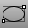
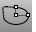

---
---

# Ellipse toolbar
{: #kanchor2326}
 [To open a toolbar](javascript:void(0);) Toolbars can be opened as a free-standing group or added to the current group.
To open a toolbar as a free-standing group
Click theOptionsicon in any toolbar group.On the menu, clickShow Toolbar, and then select the toolbar name from the list.To open a toolbar as a new tab in the current group
Click theOptionsicon in the toolbar group where you want to add the new tab.On the menu, clickShow or Hide Tabs, and then select the toolbar name from the list. [Ellipse](ellipse.html) 
Draw a closed elliptical curve from focus points, center and edges, bounding rectangle, and around a curve.
 [Ellipse, *AroundCurve* ](ellipse.html#aroundcurve) 
Draws a closed elliptical curve around curve.
 [Ellipse, *Corner* ](ellipse.html#corner) 
Draws a closed elliptical curve by corners.
 [Ellipse, *Diameter* ](ellipse.html#diameter) 
Draws a closed elliptical curve by diameter.
 [Ellipse, *Deformable* ](ellipse.html#deformable) 
Draws a NURBS approximation of an ellipse.
 [Ellipse, *FromFoci* ](ellipse.html#fromfoci) 
Draws a closed elliptical curve from foci.
&#160;
&#160;
Rhinoceros 6 © 2010-2015 Robert McNeel &amp; Associates.11-Nov-2015
 [Open topic with navigation](ellipse-toolbar.html) 

