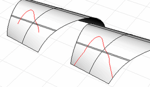

---
---

# ExtendCrvOnSrf
{: #kanchor952}
{: #kanchor951}
 [Where can I find this command?](javascript:void(0);) Toolbars
 [Extend](extend-toolbar.html) 
Menus
Curve
Extend Curve
Curve on Surface
The ExtendCrvOnSrf command lengthens a curve on a surface to the specified surface edge.

Steps
 [Select](select-objects.html) curves on a surface.Select the surface.Command-line options
EndToExtend
Specifies which end of the curve to extend.
Start
Extends only the start of the curve.
Use the [CrvStart](crvstart.html) command to locate the start of the curve.
End
Extends only the end of the curve.
Use the [CrvEnd](crvstart.html#crvend) command to locate the start of the curve.
Both
Extends both ends of the curve.
Use the [CrvStart](crvstart.html) or [CrvEnd](crvstart.html#crvend) commands to locate the start/end of the curve.
See also
 [Extend curves and surfaces](sak-extend.html) 
&#160;
&#160;
Rhinoceros 6 © 2010-2015 Robert McNeel &amp; Associates.11-Nov-2015
 [Open topic with navigation](extendcrvonsrf.html) 

