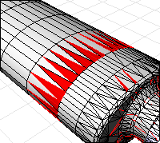

---
---

# Extract mesh faces
The Extract Mesh Faces commands help to edit existing meshes by removing unwanted or unnecessary faces from the mesh. Mesh faces can be extracted using:
 [Selecting individual faces](#extractmeshfaces). [A specified maximum or minimum area](#extractmeshfacesbyarea). [A specified aspect ratio](#extractmeshfacesbyaspectratio). [By a view-based draft angle](#extractmeshfacesbydraftangle). [Duplicate faces](#extractduplicatemeshfaces). [A specified edge length](#extractmeshfacesbyedgelength). [Faces that are connected to a selected face](#extractconnectedmeshfaces) .Note
Some STL/SLA printers have problems if meshes contain many long, thin facets. These can slow the printer's slicing process down, produce odd printed results, and run the printer out of memory.The [MeshRepair](meshrepair.html) command may be useful when tuning up meshes for STL/SLA printing.
# ExtractMeshFaces
{: #kanchor961}
{: #extractmeshfaces}
 [Where can I find this command?](javascript:void(0);) Toolbars
 [Extract Mesh](extract-mesh-toolbar.html)  [Mesh Tools](mesh-tools-toolbar.html) 
Menus
Mesh
Mesh Edit Tools
Extract
Faces
The ExtractMeshFaces command separates selected mesh faces from the parent mesh object.
This command works best in shaded mode, because you can pick the shaded mesh faces as well as the face edges.

Steps
 [Select](select-objects.html) mesh faces.Command-line option
MakeCopy
Yes
Makes a copy of the selected mesh faces rather than extracting them from the parent mesh object.
No
Extracts the mesh faces leaving a hole in the parent mesh object.

# ExtractMeshFacesByArea
{: #kanchor962}
{: #extractmeshfacesbyarea}
 [Where can I find this command?](javascript:void(0);) Toolbars
 [Extract Mesh](extract-mesh-toolbar.html) 
Menus
Mesh
Mesh Edit Tools
Extract
By Area
The ExtractMeshFacesByArea command separates mesh faces that are within a specified range of area from the parent mesh object.

Steps
 [Select](select-objects.html) a mesh object.Extract mesh faces by area options
Select faces larger than ___
Selects mesh faces with an area larger than the specified setting.
 **Select smallest face** 
Select a mesh face to set the area of the smallest face.
Select faces smaller than
Selects mesh faces with an area smaller than the specified setting.
 **Select largest face** 
Select a mesh face to set the area of the largest face.
Increment
Sets the amount the value is changed with each arrow click.
 **Select range from face** 
Select an example mesh face to set the size range. A range of ±10% of the area of the selected face is used.
Border only
Makes polylines out of the edges of the selected mesh faces instead of extracting them from the parent mesh object.
Extract a copy
Makes a copy of the selected mesh faces rather than extracting them from the parent mesh object.

# ExtractMeshFacesByAspectRatio
{: #kanchor963}
{: #extractmeshfacesbyaspectratio}
 [Where can I find this command?](javascript:void(0);) Toolbars
 [Extract Mesh](extract-mesh-toolbar.html) 
Menus
Mesh
Mesh Edit Tools
Extract
By Aspect Ratio
The ExtractMeshFacesByAspectRatio command separates mesh faces from the parent mesh object that are greater than the specified aspect ratio limit.
ExtractMeshFacesByAspectRatio finds mesh faces that are very long compared to their width. A ratio of 25:1 or above is considered long.
In the image, the extracted red faces have an aspect ratio of 9:1 or more.

Steps
 [Select](select-objects.html) a mesh object.Extract mesh faces by aspect ratio options
Aspect ratio ___ to 1
Set the target aspect ratio.
Increment
Sets the amount the value is changed with each arrow click.
 **Select aspect ratio from face** 
Select a mesh face to specify theAspect Ratiovalue.
Border only
Makes polylines out of the edges of the selected mesh faces instead of extracting them from the parent mesh object.
Extract a copy
Makes a copy of the selected mesh faces rather than extracting them from the parent mesh object.

# ExtractMeshFacesByDraftAngle
{: #kanchor964}
{: #extractmeshfacesbydraftangle}
 [Where can I find this command?](javascript:void(0);) Toolbars
 [Extract Mesh](extract-mesh-toolbar.html) 
Menus
Mesh
Mesh Edit Tools
Extract
By Draft Angle
The ExtractMeshFacesByDraftAngle command separates mesh faces from the parent mesh object based on the angle of the faces to the view.
ExtractMeshFacesByDraftAngle can split a mesh object for molds or to look for undercut areas. In the example, the mesh faces were selected in the top view.

Steps
 [Select](select-objects.html) a mesh object.Extract mesh faces by draft angle options
Start angle from camera direction
Sets the starting angle from the direction of the viewport camera.
End angle from camera direction
Sets the ending angle from the direction of the viewport camera.
Border only
Makes polylines out of the edges of the selected mesh meshes instead of extracting them from the parent mesh object.
Extract a copy
Makes a copy of the selected mesh faces rather than extracting them from the parent mesh object.

# ExtractMeshFacesByEdgeLength
{: #kanchor965}
{: #extractmeshfacesbyedgelength}
 [Where can I find this command?](javascript:void(0);) Toolbars
 [Extract Mesh](extract-mesh-toolbar.html) 
Menus
Mesh
Mesh Edit Tools
Extract
By Edge Length
The ExtractMeshFacesByEdgeLength command separates selects mesh faces from the parent mesh object that have an edge length greater or less than a specified value.
ExtractMeshFacesByEdgeLength removes small or large mesh faces that do not belong in the mesh object.
In the example image, the extracted red faces have an edge length shorter than 0.1.

Steps
 [Select](select-objects.html) a mesh object.Extract mesh faces by edge length options
Edge length
Sets the mesh edge length to compare.
 **Select edge** 
Pick a mesh edge to specify the edge length you want.
Increment
Sets the amount the value is changed with each arrow click.
Select edges:
Shorter than edge length
Selects mesh faces with an edge length shorter than theEdge lengthsetting.
Longer than edge length
Selects mesh faces with an edge length longer than theEdge lengthsetting.
Border only
Makes polylines out of the edges of the selected mesh faces instead of extracting them from the parent mesh object.
Extract a copy
Makes a copy of the selected mesh faces rather than extracting them from the parent mesh object.

# ExtractConnectedMeshFaces
{: #kanchor967}
{: #kanchor966}
{: #extractconnectedmeshfaces}
 [Where can I find this command?](javascript:void(0);) Toolbars
 [Extract Mesh](extract-mesh-toolbar.html) 
Menus
Mesh
Mesh Edit Tools
Extract
Connected
The ExtractConnectedMeshFaces command separates mesh faces from the parent mesh object that are connected to a selected face.
The ExtractConnectedMeshFaces command extracts a set of mesh faces from a joined mesh object based on a specified break angle. This can be used to extract a series of mesh faces that make up a planar surface in a mesh object or to extract set of faces that make up a coherent feature in the mesh.
Steps
 [Select](select-objects.html) mesh faces, and press [Enter](enter-key.html) .Adjust options to get the selection you want.Your browser does not support the video tag.Extract connected mesh faces options
Extract faces connected with angle
Sets the angle between mesh faces for selection.
Less than / Greater than ___ degrees
Note
A setting of 0 will give you all the mesh faces that are connected and planar with the face you select.Sometimes planar meshes have a little noise in them, so a angle of 1 can help select planar faces.Increment
Sets the amount the value is changed with each arrow click.
 **Select faces to measure angle** 
Select two mesh faces to specify the angle you want.
Border only
Makes polylines out of the edges of the selected mesh faces instead of extracting them from the parent mesh object.
Extract a copy
Makes a copy of the selected mesh faces rather than extracting them from the parent mesh object.
 **Edit Selection** 
Click to select a different mesh face.

# ExtractDuplicateMeshFaces
{: #kanchor968}
{: #extractduplicatemeshfaces}
 [Where can I find this command?](javascript:void(0);) Toolbars
 [Extract Mesh](extract-mesh-toolbar.html) 
Menus
Mesh
Mesh Edit Tools
Extract
Duplicate
The ExtractDuplicateMeshFaces command separates duplicated mesh faces from the parent mesh object.
Steps
 [Select](select-objects.html) mesh objects.
# ExtractMeshPart
{: #extractmeshpart}
 [Where can I find this command?](javascript:void(0);) Toolbars
 [Extract Mesh](extract-mesh-toolbar.html) 
Menus
Mesh
Mesh Edit Tools
Extract
Part
The ExtractMeshPart command extracts all mesh faces radiating out from the selected face to naked or unwelded edges in the parent mesh object.
Note
Some STL/SLA printers have problems if meshes contain many long, thin facets. These can slow the printer's slicing process down, produce odd printed results, and run the printer out of memory.The [MeshRepair](meshrepair.html) command may be useful when tuning up meshes for STL/SLA printing.Steps
 [Select](select-objects.html) a mesh object.Command-line options
MakeCopy
Yes
Makes a copy of the selected mesh faces rather than extracting them from the parent mesh object.
No
Extracts the mesh face leaving a hole in the parent mesh object.
EditSelection
Change which mesh faces are selected.
BorderOnly
Makes polylines out of the edges of the selected mesh faces instead of extracting them from the parent mesh object.
ExtractToNonManifoldEdges
Adds non-manifold edges (edges common to three or more faces) to the selection criteria.
See also
 [Collapse mesh faces and vertices](sak-collapsemesh.html) 
 [Extract object sub-elements](sak-extract.html) 
 [Edit mesh objects](sak-meshtools.html) 
 [White paper: Scan, Cleanup, Remodel](http://download.rhino3d.com/download.asp?id=ScanCleanupRemodel) 
&#160;
&#160;
Rhinoceros 6 © 2010-2015 Robert McNeel &amp; Associates.11-Nov-2015
 [Open topic with navigation](extractmeshfaces-commands.html) 

