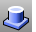
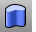
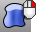
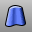
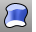
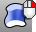
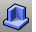
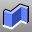

---
---

# Extrude Solid toolbar
{: #kanchor2331}
 [To open a toolbar](javascript:void(0);) Toolbars can be opened as a free-standing group or added to the current group.
To open a toolbar as a free-standing group
Click theOptionsicon in any toolbar group.On the menu, clickShow Toolbar, and then select the toolbar name from the list.To open a toolbar as a new tab in the current group
Click theOptionsicon in the toolbar group where you want to add the new tab.On the menu, clickShow or Hide Tabs, and then select the toolbar name from the list. [Boss](boss.html) 
Extrude closed planar curves normal to the curve plane toward a boundary surface where the boundary surface is trimmed and joined to the extruded objects.
 [ExtrudeCrv](extrudecrv.html) 
Drive closed planar curves in a straight line.
 [ExtrudeCrvAlongCrv](extrudecrvalongcrv.html) 
Drive closed planar curves along a path curve.
 [ExtrudeCrvAlongCrv, *SubCurve* ](extrudecrvalongcrv.html) 
Drives closed planar curves along a sub curve.
 [ExtrudeCrvTapered](extrudecrvtapered.html) 
Drive closed planar curves in a straight line tapering at an angle.
 [ExtrudeCrvToPoint](extrudecrvtopoint.html) 
Drive closed planar curves tapering to a point.
 [ExtrudeSrf](extrudesrf.html) 
Drive surface edges in a straight line to create a solid.
 [ExtrudeSrfAlongCrv](extrudesrfalongcrv.html) 
Drive surface edges along a path curve to create a solid.
 [ExtrudeSrfAlongCrv, *SubCurve* ](extrudecrvalongcrv.html) 
Drives closed planar curves along a sub curve.
 [ExtrudeSrfTapered](extrudesrftapered.html) 
Drive surface edges in a straight line tapering at an angle to create a solid.
 [ExtrudeSrfToPoint](extrudesrftopoint.html) 
Drive surface edges tapering to a point to create a solid.
 [Rib](rib.html) 
Extrude a curve in two directions to a boundary surface.
 [Slab](slab.html) 
Offset a polyline, and extrude and cap the result to create a solid.
&#160;
&#160;
Rhinoceros 6 © 2010-2015 Robert McNeel &amp; Associates.11-Nov-2015
 [Open topic with navigation](extrude-solid-toolbar.html) 

