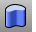

---
---

# Extrude toolbar
{: #kanchor2330}
 [To open a toolbar](javascript:void(0);) Toolbars can be opened as a free-standing group or added to the current group.
To open a toolbar as a free-standing group
Click theOptionsicon in any toolbar group.On the menu, clickShow Toolbar, and then select the toolbar name from the list.To open a toolbar as a new tab in the current group
Click theOptionsicon in the toolbar group where you want to add the new tab.On the menu, clickShow or Hide Tabs, and then select the toolbar name from the list. [ExtrudeCrv](extrudecrv.html) 
Drive closed planar curves in a straight line.
 [ExtrudeCrvAlongCrv](extrudecrvalongcrv.html) 
Drive closed planar curves along a path curve.
 [ExtrudeCrvAlongCrv, *SubCurve* ](extrudecrvalongcrv.html) 
Drives closed planar curves along a sub curve.
 [ExtrudeCrvTapered](extrudecrvtapered.html) 
Drive closed planar curves in a straight line tapering at an angle.
 [ExtrudeCrvToPoint](extrudecrvtopoint.html) 
Drive closed planar curves tapering to a point.
 [Fin](fin.html) 
Extrude a curve on a surface in the surface normal direction.
 [Ribbon](ribbon.html) 
Offset a curve and create a ruled surface between the curves.
&#160;
&#160;
Rhinoceros 6 © 2010-2015 Robert McNeel &amp; Associates.11-Nov-2015
 [Open topic with navigation](extrude-toolbar.html) 

