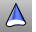

---
---

# ExtrudeSrfToPoint
{: #kanchor1009}
{: #kanchor1008}
 [Where can I find this command?](javascript:void(0);) Toolbars
 [Extrude Solid](extrude-solid-toolbar.html) 
Menus
Solid
Extrude Surface
To Point
 [&#160;History enabled](historyenabled.html) 
The ExtrudeSrfToPoint command creates a solid by tracing the path of the surface edges tapering to converge at a selected point.
Steps
 [Select](select-objects.html) a surface. [Pick](pick-location.html) the point to extrude to.Your browser does not support the video tag.Note
If the curve is not planar, then it will be extruded in the z&#160;direction of the active viewport's construction plane. If the curve is planar, it will be extruded in the normal direction of the plane of the curve.Unlike [Lofts](loft.html) and [Sweeps](sweep1.html), the initial orientation of the profile curve or surface is maintained through the extrusion.If the input is a non-planar polycurve or a planar polycurve where the extrusion direction is not normal to the curve plane, the result will be a [polysurface](polysurface.html) rather than an [extrusion object](useextrusions.html) .Command-line options
Solid
If the profile curve is closed and planar, both ends of the extruded object are filled with planar surfaces and joined to make a closed polysurface.
DeleteInput
Yes
Deletes the original geometry.
No
Retains the original geometry.
ToBoundary
Extrudes the object to a boundary surface.
See also
 [Extrude curves and surfaces](sak-extrude.html) 
&#160;
&#160;
Rhinoceros 6 © 2010-2015 Robert McNeel &amp; Associates.11-Nov-2015
 [Open topic with navigation](extrudesrftopoint.html) 

