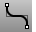

---
---

# FilletCorners
{: #kanchor1018}
{: #kanchor1017}
{: #kanchor1016}
{: #kanchor1015}
 [Where can I find this command?](javascript:void(0);) Toolbars
 [Curve Tools](curve-tools-toolbar.html) 
Menus
Curve
Fillet Corners
The FilletCorners command rounds the corners of [polycurves](polycurve.html) and [polylines](polyline.html) with arcs of a single specified radius.
Steps
 [Select](select-objects.html) polycurves and press [Enter](enter-key.html). [Specify](distance-pick-2pts.html) the fillet radius.Your browser does not support the video tag.See also
 [Fillet, blend, or chamfer between curves and surfaces](sak-fillet-blend-chamfer.html) 
&#160;
&#160;
Rhinoceros 6 © 2010-2015 Robert McNeel &amp; Associates.11-Nov-2015
 [Open topic with navigation](filletcorners.html) 

