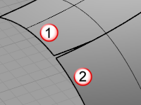
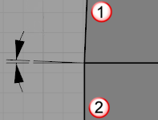
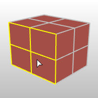
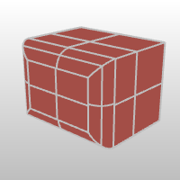

---
---

# FilletEdge
{: #kanchor1022}
{: #kanchor1021}
{: #kanchor1020}
{: #kanchor1019}
 [Where can I find this command?](javascript:void(0);) Toolbars
 [Solid Tools](solid-tools-toolbar.html) 
Menus
Solid
Fillet Edge
Fillet Edge
The FilletEdge command creates a tangent surface between polysurface edges with varying radius values then trims and joins the original faces to the fillet surfaces.
Steps
 [Select](select-objects.html) edges.Select handles.Your browser does not support the video tag.Note
Moving a handle at the end of the edge will cause the fillet to extend beyond the surface. This will have to be trimmed by other means.Use window or [Shift](shift-key.html) + mouse click to select multiple handles.Tips
Always fillet from the largest radius to the smallest radius across a model.Remove any edges you can prior to filleting with [MergeAllFaces](mergeallfaces.html) or by way of surfacing in a simpler manner. Fewer intersected edges = Fewer problems as the fillet rolls along any edges and tries to trim and join with the adjacent surfaces.Make sure there is enough room for the fillet surface to trim and join with adjacent surfaces. The angle relationships between surfaces, sharpness of the bend in the rail around corners and rail type all play a part in any particular case.Command-line options
ShowRadius
Controls the display of the current radius in the viewport.
NextRadius
Specifies the radius for the next handle.
ChainEdges
Automatically selects curves that are touching the selected curve.
How to chain select
Select the first segment.ChainEdges options
AutoChain
Selecting a curve or surface edge automatically selects all curve segments connected with the level of [continuity](continuity-descriptions.html) set by the ChainContinuity option.
ChainContinuity
Controls the level of [continuity](continuity-descriptions.html) required between segments to be selected with theAutoChainoption.
Direction
Forward
Selects curves in the positive curve [direction](dir.html#normaldirection).
Backward
Selects curves in the negative curve [direction](dir.html#normaldirection).
Both
Selects curves in both the positive and negative curve [direction](dir.html#normaldirection).
GapTolerance
If the gap between two edges/curves is less than this value, the chain selection will ignore the gap and will select the next segment.

AngleTolerance
When Continuity is set to Tangency, if the angle between two edges/curves is less than this value, the chain selection will consider the criteria for continuity met and will select the next segment.

Undo
Undo last segment selection.
Next
Select next segment.
All
Select all segments.
PreviousEdgeSelection
In cases where the command is canceled or ended prematurely, thePreviousEdgeSelectionoption re-selects the previously selected edges. Supports multiple sets of previously selected edges for up 20 previous edge sets.
Radius/Distance options
TheRadiusandDistanceoptions appear on the command line when you drag a handle grip.
FromCurve
 [Select](select-objects.html) a curve. The radius of the curve at the picked location will be used.
FromTwoPoints
 [Pick](pick-location.html) two points to show the radius distance.
Handle options
AddHandle
Adds a handle along the edges.
CopyHandle
Adds a new handle using the distance from the selected handle.
RemoveHandle
Visible only when at least one handle has been added.
SetAll
Sets the distance or radius for all handles.
LinkHandles
Editing a single handle updates all handles.
Note
Only added handles can be removed.The default handles at the ends of each open edge segment cannot be moved or deleted. This is the minimum information the command needs in order to work.The handle at the end of a single closed edge can be moved but not deleted.RailType options
Three rail types control the intersection.
DistFromEdge
The [distance](distance-pick-2pts.html) from the edge curves determines the intersection.
Your browser does not support the video tag.RollingBall
The radius of a rolling ball determines the intersection.
Your browser does not support the video tag.DistBetweenRails
The [distance](distance-pick-2pts.html) between the edge rails determines the intersection.
Your browser does not support the video tag.TrimAndJoin
Trims and joins the resulting surface to the input surfaces.
 [History](history.html) only works if TrimAndJoin=No.
SelectEdges
Allows selecting more edges after the selection has been closed.
FaceEdges
Activates a face selection step.
FaceEdges steps
At the prompt, select polysurface faces, and press&#160; [Enter](enter-key.html) .Edges of the selected faces are added to the set of edges to fillet.Add or remove edges.Select and adjust handles, and press&#160; [Enter](enter-key.html) .Preview
Displays a dynamic preview.
You can change the options and the preview will update.
Edit
Allows changing the radius of existing fillets.
To edit fillets
Select the object to edit.The filleted edges highlight.Select the edges to fillet.Select the edges you want to change.This can include previously unfilleted edges on the object.Select the fillet handles to change and enter new values.To remove a fillet
Select the object to edit.The filleted edges highlight.Use [Ctrl](ctrl-key.html) +click to select the edges where you want to remove the fillet, and press&#160; [Enter](enter-key.html) .See also
 [Fillet, blend, or chamfer between curves and surfaces](sak-fillet-blend-chamfer.html) 
 [Rhino Wiki: Advanced Filleting](http://wiki.mcneel.com/rhino/advancedfilleting) 
&#160;
&#160;
Rhinoceros 6 © 2010-2015 Robert McNeel &amp; Associates.11-Nov-2015
 [Open topic with navigation](filletedge.html) 

