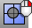

---
---

# Geometry Fix toolbar
{: #kanchor2333}
 [To open a toolbar](javascript:void(0);) Toolbars can be opened as a free-standing group or added to the current group.
To open a toolbar as a free-standing group
Click theOptionsicon in any toolbar group.On the menu, clickShow Toolbar, and then select the toolbar name from the list.To open a toolbar as a new tab in the current group
Click theOptionsicon in the toolbar group where you want to add the new tab.On the menu, clickShow or Hide Tabs, and then select the toolbar name from the list. [Check](check.html) 
Report errors in an object's data structure.
 [CheckNewObjects](check.html#checknewobjects) 
Report errors in an object's data structure as it is created or imported.
 [Explode](explode.html) 
Break objects down into components.
 [ExtractSrf](extractsrf.html) 
Separate or duplicate a polysurface face.
 [Hide](hide.html) 
Conceal objects from view.
 [Invert](selection-commands.html#invert) and [Hide](hide.html) 
Deselect all selected objects and select all previously unselected objects and hide.
 [Join](join.html) 
Connect curves, surface edges, or surfaces to form a single object.
 [JoinEdge](joinedge.html) 
Join two naked edges that are out of tolerance.
 [PointsOn](pointson.html) 
Display curve and surface control points.
 [PointsOff](pointson.html#pointsoff) 
Turn off [control](pointson.html), [edit](pointson.html#editpton), and [solid](pointson.html#solidpton) points display.
 [SelBadObjects](selection-commands.html#selbadobjects) 
Select all objects that do not pass [Check](check.html).
 [Show](hide.html#show) 
Redisplay all hidden objects.
 [ShowEdges](showedges.html) 
Highlight edges of surfaces and polysurfaces. Displays the Edge Analysis control.
 [ShowEdgesOff](showedges.html#showedgesoff) 
Turn off edge display.
 [ShowSelected](hide.html#showselected) 
Redisplay selected hidden objects.
 [ShrinkTrimmedSrf](shrinktrimmedsrf.html) 
Contract the underlying untrimmed surface close to trimming boundaries.
 [ShrinkTrimmedSrfToEdge](shrinktrimmedsrf.html#shrinktrimmedsrftoedge) 
Contract the underlying untrimmed surface as close as possible to the trimming boundaries.
 [Smooth](smooth.html) 
Average the positions of curve and surface [control points](controlpoint.html) and mesh vertices in a specified region and evens out the spacing of selected control points in small increments to remove unwanted detail, and loops in curves and surfaces.
 [Split](split.html) 
Divide objects using other objects as cutters.
 [Split,Isocurve](split.html#isocurve) 
Divide objects using isocurves as cutters.
 [Trim](trim.html) 
Cut and delete selected portions of an object at the intersection with another object.
 [Untrim](trim.html#untrim) 
Remove trim curves from trimmed surfaces.
 [Undo](undo.html) 
Undo the last action.
 [Redo](undo.html#redo) 
Reverse the last Undo.
 [Untrim](trim.html#untrim) 
Remove trim curves from trimmed surfaces.
 [UnTrim, *KeepTrimObjects* ](trim.html) 
Remove trim curves and joined surfaces keeping the trimmed objects.
&#160;
&#160;
Rhinoceros 6 © 2010-2015 Robert McNeel &amp; Associates.11-Nov-2015
 [Open topic with navigation](geometry-fix-toolbar.html) 

