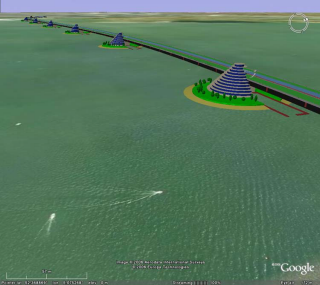

---
---

{: #kanchor2999}{: #kanchor3000}
# Google Earth (.kmz) export
KMZ is a file format used to display geographic data in an Earth browser such as Google Earth, Google Maps, and Google Maps for mobile.
To save as or export a Rhino model
From theFilemenu, click [Export Selected](export.html) or [Save As](save.html#saveas) .In the dialog box, theFiles of typelist displays the currently supported file types for export.In theFiles of typebox, select the supported file type.In theFile namebox, select or type a file name.Specify what is to be saved.Save small
Though clearing the render meshes makes the file smaller, it will shade and render more slowly the next time you open the file.
Save geometry only
Saves geometry objects only. No layers, materials, properties, notes, or units settings are saved.
This is similar to exporting the objects. A new file is made, but it does not become your active Rhino model.
Save Textures
Embeds external textures used by materials, environments and decals into the model.
Save plugin data
Saves data attached to objects or the document by plug-in applications.
If the export can be configured, click **Options** to specify export settings.If the file type creates only mesh objects, in the [Polygon Mesh Objects](polygon-mesh-simple-options.html) dialog box, specify the mesh settings.Note
Google Earth .kmz files can be published on your web site like an other web-compatible file type (.html, .jpg, .gif, etc.) but your web server needs to be aware of .kmz files.Use the [EarthAnchorPoint](earthanchorpoint.html) command to set the earth anchor point.Work in building-sized units, like meters.Set the Perspective view [lens length](perspectiveangle.html) to 21mm. This closely matches the camera angle used by Google Earth.When you save the Google Earth file, make sure you are in a Perspective viewport looking at the object from above ground level. [Mesh](mesh.html) complicated polysurfaces and keep the meshes small.The [diffuse material color](materialeditor.html#color-diffuse) is what shows in Google.You can open, edit, and save .kmz files with Google Earth to add additional features beyond 3&#8209;D geometry.See also
 [KML Tutorial](http://code.google.com/apis/kml/documentation/kml_tut.html) 
 [Use Rhino to create a 3-D model of a bridge in Google Earth](http://wiki.mcneel.com/rhino/flevodam) 

&#160;
&#160;
Rhinoceros 6 © 2010-2015 Robert McNeel &amp; Associates.11-Nov-2015
 [Open topic with navigation](google-earth-kml-kmz-export.html) 

