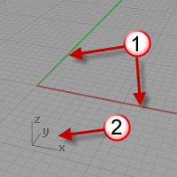

---
---

{: #kanchor2633}{: #kanchor2634}{: #kanchor2635}{: #kanchor2636}{: #kanchor2637}{: #kanchor2638}{: #kanchor2639}{: #kanchor2640}{: #kanchor2641}{: #kanchor2642}{: #kanchor2643}{: #kanchor2644}{: #kanchor2645}{: #kanchor2646}{: #kanchor2647} [Where can I find this command?](javascript:void(0);) Toolbars
 [File](file-toolbar.html)  [Properties](properties-toolbar.html)  [Standard](standard-toolbar.html) 
Menus
File
Properties
The Grid properties manage the grid settings for the current model.
Note
The grid is an array of lines lying on a portion of the construction plane in the viewport.The construction plane is infinite. The grid covers only a specified portion of it.Grid settings control the spacing of the grid lines and the visibility of the grid, grid axes, and world axes icon.{: #grid-applychangesto}Apply grid changes to
Active viewport only ( *&lt;active viewport name&gt;* )
Uses the grid settings in the named active viewport only.
All viewports
Applies the grid settings to all viewports.
Grid properties
{: #grid-extents}Grid line count
Defines the number of minor grid lines. The maximum size of the grid is 100,000 lines.
{: #grid-minor-spacing}Minor grid lines every ___ *&lt;current units&gt;* 
In Rhino units, defines the spacing of the minor grid lines.
{: #grid-major-spacing}Major lines every ___ minor grid lines
Defines the major grid line interval.
Show grid lines{: #grid-visibility}
Toggles the visibility of the construction plane grid.
Show grid axes{: #grid-axes-visibility}
Toggles the visibility of the grid x and y&#160;axes.

Grid axes (1), world axis icon (2).
Show world axis icon{: #world-icon-visibility}
Toggles the visibility of the world coordinate icon in the bottom left corner of a viewport.
Grid snap
{: #grid-snap-spacing}Snap spacing ___ *&lt;current units&gt;* 
Sets the grid snap spacing in Rhino units.
See also
 [Manage document properties](sak-documentproperties.html) 
 [Grid](grid.html) 
Set grid properties.
&#160;
&#160;
Rhinoceros 6 © 2010-2015 Robert McNeel &amp; Associates.11-Nov-2015
 [Open topic with navigation](grid.html) 

