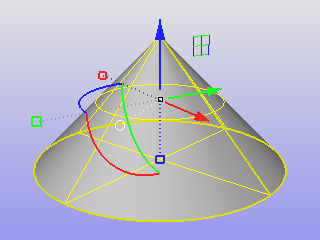
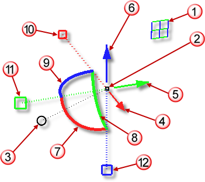
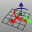
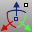

---
---

{: #kanchor1091}{: #kanchor1092}{: #kanchor1093}{: #kanchor1094}{: #kanchor1095}{: #kanchor1096}{: #kanchor1097}{: #kanchor1098}{: #kanchor1099}{: #kanchor1100}{: #kanchor1101}{: #kanchor1102}{: #kanchor1103}
# Gumball
 [Where can I find this command?](javascript:void(0);) Toolbars
 [Gumball toolbar](gumball-toolbar.html) 
Menus
 [Not on menus.](menuwhattodo.html) 
 [Status bar](rhino-window.html#statusbarpanes) 
Gumball
The Gumball command displays the gumball widget on a selected object facilitating move, scale, and rotate transformations around the gumball origin.

Steps
Click the [Gumball](rhino-window.html#gumball-pane) pane in the status bar.Object actions
Drag gumball arrows to [Move](move.html) the object.Drag scale handles (squares) to [Scale](scale1d.html) the object in one direction.Drag arcs to [Rotate](rotate.html) the object.Tap [Alt](alt-key.html) after starting to drag to toggle copy mode.Press and hold [Shift](shift-key.html) during [Scale](scale1d.html) to force [3-D scale](scale.html) .Press and hold [Shift](shift-key.html) while clicking and dragging the Axis Plane Indicator to force [2-D Scale](scale2d.html) .Press and hold [Shift](shift-key.html) during [Scale](scale1d.html) to force [3-D scale](scale.html) .Press and hold [Ctrl](ctrl-key.html) during move, scale or rotate to [Extrude](extrudecrv.html) a planar curve or surface.Click a control handle to enter numeric value.Gumball controls
&#160;Axis plane indicator
Hold [Shift](shift-key.html) to scale intwo directions.&#160;Free move origin
&#160;Menu ball
Move arrows
&#160;Move X
&#160;Move Y
&#160;Move Z
Rotation arcs
&#160;Rotate X
&#160;Rotate Y
&#160;Rotate Z
Scale handles
&#160;Scale X
&#160;Scale Y
&#160;Scale Z

Overview
Axis plane indicator (1)
Drag by the plane icons to constrain movement to that plane.Gumball origin (2)
Drag the gumball origin to drag the whole object in any direction.Menu ball "bunny tail" (3)
Click to change [gumball settings](#gumball-options) .The menu ball is off by default. To turn it on in [Gumball options](modeling-aids-gumball.html), set the size to a positive value.Move arrows (4, 5, 6)
Click and drag a gumball x, y, or z&#160;arrow control to move the objects in the arrow direction.Rotation arcs (7, 8, 9)
Rotate the object on the gumball center.Click to enter a specific number of degrees.Scale handles (10, 11, 12)
Click and drag a gumball scale handle to [scale in one dimension](scale1d.html) along the arrow axis.Press and hold [Shift](shift-key.html) to force a [3-D scale](scale.html) .The origin is the gumball center.Copy
Tap [Alt](alt-key.html) while dragging any control to create a copy.Specify a value
Click any control to specify a distance, angle, or scale factor.Command-line options
On
Turns gumball widgets on for selected objects.
Off
Turns gumball widgets off.
{: #toggle}Toggle
Toggles the on/off state of the gumball widgets.

## Object actions
{: #move}{: #rotate}{: #scale}Move, rotate, or scale objects
Click and drag any gumball arrow, arc, or scale handle.{: #copy}Copy during any operation
Click any gumball arrow, arc, or scale handle.Start dragging the object.Tap the [Alt](alt-key.html) to toggle copy mode on.Tap the [Alt](alt-key.html) again to turn off copy mode.Specify a distance, rotation angle, or scale factor
Click any gumball arrow, arc, or scale handle.In the edit box, type a distance, rotation angle or scale factor that will be applied to the selected object.Note
When units are specified, such as 2" or 2mm, the scale handle and the objects being transformed are scaled to that length.When a + or - is used with the units, gumball handle will grow or shrink by that amount. This can make objects a specific distance longer or shorter than the current size in that direction without needing to calculate a scale factor. Other units can be specified, but model units are used by default.This is different from Rhino 5, where a negative scale number would flip object - mirror it and scale by the number as a factor.Units also work in the Move controls of the gumball.Copy with numeric input
Press and hold [Alt](alt-key.html) and click any gumball arrow, arc, or scale handle.In the edit box, type a distance, rotation angle or scale factor that will be applied to acopyof the selected object.Use distance and angle constraint
Normal Rhino [distance](cursor-constraints.html#distance-constraint) and [angle](cursor-constraints.html#angle) constraints can be used during a gumball operation.
Start dragging an object.Type a number, and press [Enter](enter-key.html) .This number appears on the command line and is used to constrain a distance or angle of rotation.Drag the object.Distances are constrained along the axis arrow line.Angles are constrained in increments of the angle around the rotation arc.Extrude a curve or surface
Click and drag any gumball arrow on a planar curve or surface.Press and hold [Ctrl](ctrl-key.html) .Release the mouse button.To extrude a specific distance
Start dragging a planar curve or surface.With the mouse button down, type a distance and press [Enter](enter-key.html) .This number appears on the command line and will constrain the distance.Press and hold [Ctrl](ctrl-key.html) and release the mouse button.
## Gumball widget location and orientation
To move, rotate, or scale the gumball widget controls freely
Press and hold [Ctrl](ctrl-key.html) and click and drag the gumball control to move, rotate, or scale the control freely.To move rotate, or scale the gumball widget controls with numeric control
Press and hold [Ctrl](ctrl-key.html) and click any gumball arrow, arc, or scale control.In the edit box, type a distance, rotation angle or scale factor that will be applied to the gumball control.Relocate Gumball
Press [Ctrl](ctrl-key.html) and click the gumball widget (ignore the text field).Release [Ctrl](ctrl-key.html) and start dragging to relocate the gumball widget.
## Status Bar options
{: #gumball-options}
To access the status bar menu
Right-click the [Gumball pane](rhino-window.html#gumball-pane) in the [status bar](rhino-window.html#statusbarpanes) to access options.Options
{: #autoreset}AutoReset Gumball
The orientation of the gumball instantly snaps back to its starting state: Object, CPlane, or World.
This setting allows free rotation of the object while constraining the original orientation.
Gumball On
Turns the gumball widget on any time objects are selected.
Gumball Off
Disables auto gumball.
{: #align-to-cplane}Align to CPlane
Gumball widgets align to the [construction plane](cplane.html).
{: #align-to-object}Align to Object
Gumball widgets align to the object [direction](dir.html) for:
CurvesExtrusion objectsLightsMesh faces and edges and verticesPlanar objects and sub-objectsThe camera object ( [Camera](camera.html) ) and [NamedView](namedview.html) camera widgetExceptions
Free-form top-level objects
The gumball aligns with the construction plane with its origin at the object's centroid.
Curve control points
The gumball z&#160;direction (blue arrow) aligns with the curve normal.
The gumball x&#160;direction (red arrow) aligns with the curve tangent.
Surface control points
The gumball z&#160;direction (blue arrow) aligns with the surface normal.
The gumball x&#160;direction (red arrow) aligns with the surface u&#160;direction.
{: #align-to-world}Align to World
Gumball widgets align to [world xyz directions](cursor-constraints.html#world-coordinates).
{: #snappy-dragging}Snappy Dragging
Object snaps are used when dragging.
{: #smooth-dragging}Smooth Dragging
Object snaps are ignored when dragging.
Rotate View Around Gumball
Rotate both the [view camera](viewport.html#camera-location) and [view target](viewport.html#target-location) at the gumball origin when rotating the view.
{: #set-drag-strength}Set Drag Strength
Sets the amount of the gumball drag as a percentage of mouse movement to control the speed of the gumball movement. The default 100% moves the gumball normally with the mouse.
To fine-tune placing objects (such as with control point editing) set the strength lower, so large hand/mouse movements result in smaller gumball changes.
Setting the strength to greater than 100% speeds up the gumball movement.
Settings
Opens [Gumball options](modeling-aids-gumball.html).

## Menu ball options
The menu ball is off by default. To turn it on in [Gumball options](modeling-aids-gumball.html), set the size to a positive value.
To access the menu ball options
Click the gumball widget menu ball.Relocate gumball
Drag to relocate gumball widget away from its default position.
{: #reset}Reset gumball
Restores the default placement and orientation for the gumball.
 [Align to CPlane](#align-to-cplane) 
 [Align to Object](#align-to-object) 
 [Align to World](#align-to-world) 
 [Snappy Dragging](#snappy-dragging) 
 [Smooth Dragging](#smooth-dragging) 
 [Set Drag Strength](#set-drag-strength) 
 [Settings](modeling-aids-gumball.html) 

# Related commands

## GumballAlignment
{: #gumballalignment}
 [Where can I find this command?](javascript:void(0);) Toolbars
 [Gumball toolbar](gumball-toolbar.html) 
Menus
 [Not on menus.](menuwhattodo.html) 
The GumballAlignment command resets the gumball widget alignment.
Notes
Alignment will not change if you have previously modified the gumball position or orientation.Right-click the gumball and use [Reset](#reset) from the gumball context menu to force the new alignment for these objects.Alignment is based on the object bounding box{: #kanchor1104}.Command-line options
CPlane
Sets the gumball widget alignment to the active [construction plane](#align-to-cplane).
Object
Sets the gumball widget alignment to the selected [object](#align-to-object).
World
Sets the gumball widget alignment to [world coordinates](#align-to-world).

## GumballScaleMode
{: #gumballscalemode}
 [Where can I find this command?](javascript:void(0);) Toolbars
 [Not on toolbars.](toolbarwhattodo.html) 
Menus
 [Not on menus.](menuwhattodo.html) 
The GumballScaleMode command sets the size of the scale handles either relative to the object or based on the gumball radius.
Command-line options
Mode
Relative
Handle size is based on theRelativeHandlePositionMultipliersetting.
Absolute
Handle size is clamped to the object size.
RelativeHandlePositionMultiplier
Specifies the size of the scale handles relative to the [Gumball radius](modeling-aids-gumball.html#gumball-radius) setting. Numbers larger than 1 make the gumball scale handles longer than the [Gumball radius](modeling-aids-gumball.html#gumball-radius). Numbers between 0 and 1 make the gumball scale handles shorter than the [Gumball radius](modeling-aids-gumball.html#gumball-radius).

## GumballRelocate
{: #gumballrelocate}
 [Where can I find this command?](javascript:void(0);) Toolbars
 [Gumball toolbar](gumball-toolbar.html) 
Menus
 [Not on menus.](menuwhattodo.html) 
The GumballRelocate command moves the gumball widget origin and orientation on an object.
Another way to move relocate the gumball is to press and hold [Ctrl](ctrl-key.html) to drag the gumball widget rather than the object.
Steps
 [Pick a location](pick-location.html) for the gumball origin.Press [Enter](enter-key.html) to reset the gumball y and z&#160;axes automatically based on the active viewport construction plane and the x&#160;axis direction.Pick a location the gumball x&#160;axis direction.Pick a point to specify the gumball y&#160;axis orientation.Release [Ctrl](ctrl-key.html) use object snaps to place the widget at a snap location.
## GumballAutoReset
{: #gumballautoreset}
 [Where can I find this command?](javascript:void(0);) Toolbars
 [Not on toolbars.](toolbarwhattodo.html) 
Menus
 [Not on menus.](menuwhattodo.html) 
The GumballAutoReset command makes the orientation of the gumball instantly snap back to its starting state: Object, CPlane, or World.
This setting allows free rotation of the object while constraining the original orientation.
The command toggles the [AutoReset](#autoreset) mode on and off.
See also
 [Move objects](sak-move.html) 
 [Transform objects](sak-transform.html) 
&#160;
&#160;
Rhinoceros 6 © 2010-2015 Robert McNeel &amp; Associates.11-Nov-2015
 [Open topic with navigation](gumball.html) 

