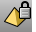
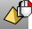
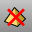
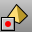
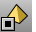
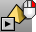

---
---

# History toolbar
{: #kanchor2338}
 [To open a toolbar](javascript:void(0);) Toolbars can be opened as a free-standing group or added to the current group.
To open a toolbar as a free-standing group
Click theOptionsicon in any toolbar group.On the menu, clickShow Toolbar, and then select the toolbar name from the list.To open a toolbar as a new tab in the current group
Click theOptionsicon in the toolbar group where you want to add the new tab.On the menu, clickShow or Hide Tabs, and then select the toolbar name from the list. [History](history.html) 
Store the connection between a command's input geometry and the result, so that when the input geometry changes, the result updates accordingly.
 [History, *Lock=Yes* ](history.html#lock-yes) 
Lock objects with history.
 [History, *Lock=No* ](history.html#lock-yes) 
Unlock objects with history.
 [HistoryPurge](history.html#historypurge) 
Remove history from an object and its children.
 [History, *Record Yes* ](history.html#history-record) 
Record the state of input objects and update output objects when input objects change.
 [History, *Record No* ](history.html#history-record) 
Stop history recording.
 [HistoryUpdate](history.html#historyupdate) 
Redefine selected objects when parents are changed.
 [HistoryUpdate, *All* ](history.html#historyupdate-all) 
Redefine all objects when their parents are changed.
 [SelChildren](selection-commands.html#selchildren) 
Select children of specified parents.
 [SelObjectsWithHistory](selection-commands.html#selobjectswithhistory) 
Select objects that have history.
 [SelParents](selection-commands.html#selparents) 
Select parents of specified children.
&#160;
&#160;
Rhinoceros 6 © 2010-2015 Robert McNeel &amp; Associates.11-Nov-2015
 [Open topic with navigation](history-toolbar.html) 

