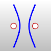
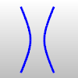
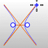

---
---

{: #kanchor1167}{: #kanchor1168}{: #kanchor1169}
# Hyperbola
 [Where can I find this command?](javascript:void(0);) Toolbars
 [Curve](curve-toolbar.html) 
Menus
Curve
Hyperbola
Center, Focus
Center, Coefficient
From Foci
Vertex, Focus
The Hyperbola command draws a hyperbolic curve.
Steps
Follow the prompts for the selected option.Your browser does not support the video tag.Command-line options
Default (Center)
The default option draws the hyperbola from the center, focus, and end.
Center steps
 [Pick](pick-location.html) the center.Pick the focus.Pick the end.Your browser does not support the video tag.FromCoefficient
The FromCoefficient option uses the A and B coefficients of the hyperbola equation to define the curve.
FromCoefficient steps
 [Pick](pick-location.html) the center.Pick a direction.Pick the end.FromCoefficient options
A/B
These are theAandBcoefficients of the equation that defines the hyperbola. The *A* coefficient represents the distance from the center point to the vertex of the hyperbola. IfCis the distance from the center point to the foci of the hyperbola, then *B* 2= *C* 2- *A* 2. The *B* coefficient can be considered the slope of the asymptotes.
{: #fromfoci}FromFoci
The FromFoci option draws the hyperbola starting from the focus points.
FromFoci steps
 [Pick](pick-location.html) the first focus.Pick the second focus.Pick the end.Your browser does not support the video tag.FromVertex
The FromVertex option draws the hyperbola starting from the vertices.
FromVertex steps
 [Pick](pick-location.html) the vertex.Pick the focus.Pick the end.Your browser does not support the video tag.Drawing and display options
MarkFoci
IfYes, a point object is placed at the focus locations.

BothBranches
IfYesboth branches of the hyperbola are drawn.

ShowAsymptotes
IfYes, the asymptotes of the hyperbola are displayed as it is drawn.

See also
 [Draw lines and curves](sak-curve.html) 
&#160;
&#160;
Rhinoceros 6 © 2010-2015 Robert McNeel &amp; Associates.11-Nov-2015
 [Open topic with navigation](hyperbola.html) 

