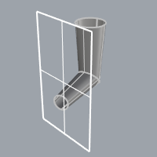
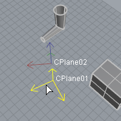

---
---

{: #kanchor2614}{: #kanchor2615}{: #kanchor2616}{: #kanchor2617}
# InfinitePlane
 [Where can I find this option?](javascript:void(0);) Toolbars
 [Select](select-toolbar.html) 
Menu
 [Not on menus.](menuwhattodo.html) 

The InfinitePlane option offers a way to intersect any plane (extended to infinity) with objects and get curves/points back. This includes construction planes, planar surfaces geometry, and planes defined on-the-fly.

Infinite plane as a trimming object.
Shortcut:IP
The InfinitePlane option can be used with any command that asks for an object including:
 [ArraySrf](arraysrf.html) 
 [Boolean2Objects](boolean2objects.html) 
 [BooleanDifference](booleandifference.html) 
 [BooleanIntersection](booleanintersection.html) 
 [BooleanSplit](booleansplit.html) 
 [BooleanUnion](booleanunion.html) 
 [Bounce](bounce.html) 
 [ChamferSrf](chamfersrf.html) 
 [Contour](contour.html) 
 [CutVolume](cutvolume.html) 
 [FilletSrf](filletsrf.html) 
 [Fin](fin.html) 
 [InterpCrvOnSrf](interpcrvonsrf.html) 
 [Intersect](intersect.html) 
 [IntersectTwoSets](intersecttwosets.html) 
 [MakeHole](makehole.html) 
 [OffsetNormal](offsetnormal.html) 
 [OffsetSrf](offsetsrf.html) 
 [OrientCameraToSrf](orientcameratosrf.html) 
 [OrientOnSrf](orientonsrf.html) 
 [PlaceHole](placehole.html) 
 [Project](project.html) 
 [Pull](pull.html) 
 [RevolvedHole](revolvedhole.html) 
 [RoundHole](roundhole.html) 
 [Section](section.html) 
 [ShortPath](shortpath.html) 
 [Trim](trim.html) 
 [TweenSurfaces](tweensurfaces.html) 
 [VariableBlendSrf](variableblendsrf.html) 
 [VariableChamferSrf](variablechamfersrf.html) 
 [VariableFilletSrf](variablefilletsrf.html) 
 [VariableOffsetSrf](variableoffsetsrf.html) 
 [WireCut](wirecut.html) 
To create an infinite plane
At any prompt to select a surface or polysurface, typeIPorInfinitePlaneAt the prompt, select a planar object to use as a temporary infinite plane.This can be a planar curve, surface, polysurface face, a single polygon mesh, or a clipping plane.The plane of the object defines the location and direction of the infinite plane.A reference plane appears in the viewport. The reference plane uses the [Tracking lines color](appearance-colors.html#tracking-lines).
## Command-line options
Options that draw a new infinite plane
Use these options to draw a new infinite plane.
{: #3point}3Point
Three points define the location and the direction of the plane.
3Point steps
Pick the first point of plane.Pick the second point of plane.Pick the third point of plane.{: #vertical}Vertical
Two points define the direction of a plane vertical to the active construction plane.
Vertical steps
Pick the start of vertical plane.Pick the end of vertical plane.{: #throughpoint}ThroughPoint
A point defines the location of a plane parallel to the current construction plane.
ThroughPoint steps
Pick a point to define the height of the plane in relation to the current construction plane.Options that use existing construction planes as reference
Use these options to use construction planes to define infinite planes.
{: #namedcplane}NamedCPlane
A named construction plane defines the infinite plane.
Custom construction planes must already exist.
NamedCPlane steps
Type the name of an existing construction plane.NamedCPlane options
SelectInViewport
The construction plane name and xy&#160;axes symbol appear at the named construction plane origin.
SelectInViewport steps
Hover the mouse over a set of axes until it highlights and click.SelectFromList
Select from a list of named construction planes.
CPlaneXY
Use the xy&#160;directions of the current construction plane to define an infinite plane.
CPlaneYZ
Use the yz&#160;directions of the current construction plane to define an infinite plane.
CPlaneZX
Use the zx&#160;directions of the current construction plane to define an infinite plane.
WorldXY
Use the xy&#160;directions of the world axes to define an infinite plane.
WorldYZ
Use the yz&#160;directions of the world axes to define an infinite plane.
WorldZX
Use the zx&#160;directions of the world axes to define an infinite plane.
&#160;
&#160;
Rhinoceros 6 © 2010-2015 Robert McNeel &amp; Associates.11-Nov-2015
 [Open topic with navigation](infiniteplane.html) 

