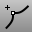

---
---

{: #kanchor1223}{: #kanchor1224}{: #kanchor1225}
# InsertKink
 [Where can I find this command?](javascript:void(0);) Toolbars
 [Point Edit](point-edit-toolbar.html) 
Menus
Edit
Control Points
Insert Kink
The InsertKink command adds [kinks](kink.html) to a curve or surface.
Steps
 [Select](select-objects.html) the curve or surface.Pick locations where you want to insert a [kink](kink.html) .Press [Enter](enter-key.html) to end the command.A curve is split into multiple joined curves.Your browser does not support the video tag.See also
 [Edit objects using control points](sak-pointediting.html).
 [Edit curves](sak-curvetools.html) 
&#160;
&#160;
Rhinoceros 6 © 2010-2015 Robert McNeel &amp; Associates.11-Nov-2015
 [Open topic with navigation](insertkink.html) 

