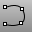

---
---

{: #kanchor1241}{: #kanchor1242}
# InterpCrv
 [Where can I find this command?](javascript:void(0);) Toolbars
 [3-D_Digitizing](3-d-digitizing-toolbar.html)  [Curve Drawing](curve-drawing-toolbar.html)  [Curve](curve-toolbar.html) 
Menus
Curve
Free-Form
Interpolate Points
The InterpCrv command draws a curve through selected locations in space.
Many CAD programs use the term *spline* to describe an interpolated curve.
Steps
 [Pick](pick-location.html) the start of the curve.Pick the next points.Press [Enter](enter-key.html) to end the curve.Your browser does not support the video tag.Command-line options
AutoClose
Closes the curve when the cursor moves close to the curve's start point.
AutoClose steps
Move the cursor close to the start point of the curve, and pick.The curve will close.Press the [Alt](alt-key.html) key to suspend automatic closing.Degree
Specifies the [degree](degree.html) of the curve (or surface).
When drawing a high-degree curve, the output curve will not be the degree you request unless there is at least one more [control point](controlpoint.html) than the degree.
Knots
Determines how an interpolated curve is parameterized. When the spacing between the picked points is equal for the whole curve, all three [parameterizations](parameterization.html) generate the same curve.
When you draw an interpolated curve, the points you pick are converted into knot values on the curve. The [parameterization](parameterization.html) means how the intervals between knots are chosen.
Uniform
The knot spacing is always 1 and is not based on the physical spacing of the points. Uniform [parameterization](parameterization.html) can be used if the point spacing is roughly equal and it is desirable to draw several curves that have the same parameterization. This is possible only with uniform curves (unless you rebuild the curves). Uniform guarantees that every [control point](controlpoint.html) affects the surface exactly the same way, no matter how much the surface is edited.
Chord
The spacing between the picked points is used for the knot spacing. This makes curves that have widely varying point spacing behave better than uniform curves.
SqrtChrd
The square root of the spacing between picked points is used for the knot spacing.
PersistentClose
The PersistentClose option closes the curve as soon as there are two points placed.
If you continue to pick points, the curve updates the shape while remaining closed.
StartTangent
Draws the start of curve tangent to another curve or tangent to a direction shown by picking a start and end direction.
Your browser does not support the video tag.
EndTangent
Draws the end of the curve tangent to another curve or tangent to a direction shown by picking a start and end direction.
Your browser does not support the video tag.
Close
Closes the curve smoothly, creating a [periodic curve](makeperiodic.html).
Sharp
Closes the curve with a kink, creating a [non-periodic curve](makeperiodic.html#makenonperiodic).
Undo
The Undo option reverses the last action.
See also
 [Draw lines and curves](sak-curve.html) 
&#160;
&#160;
Rhinoceros 6 © 2010-2015 Robert McNeel &amp; Associates.11-Nov-2015
 [Open topic with navigation](interpcrv.html) 

