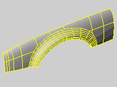

---
---

Isoparametric curve{: #kanchor3093}{: #kanchor3094}
An isoparametric curve (or isocurve) is a curve of constant u or v&#160;value on a surface. Rhino uses isocurves and surface edge curves to create a wireframe of the shape of a [NURBS](http://www.rhino3d.com/nurbs) surface. By default isocurves are drawn at [knot](knot.html) locations. If the surface is a single knot-span surface like a simple rectangular plane, isocurves are drawn also in the middle of the surface.

Isocurves displayed on a selected shaded polysurface.
See: [Wikipedia: Computer representation of surfaces](http://en.wikipedia.org/wiki/Computer_representation_of_surfaces).
 [Open topic with navigation](isocurve.html) 

