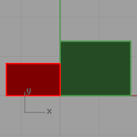
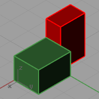
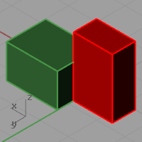
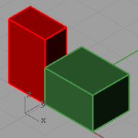
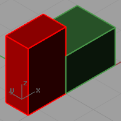

---
---

# Isometric
{: #kanchor1271}
{: #kanchor1270}
{: #kanchor1269}
{: #kanchor1268}
 [Where can I find this command?](javascript:void(0);) Toolbars
 [Isometric](isometric-toolbar.html) 
Menus
View
Set View
Isometric
NE
NW
SE
SW
The Isometric command changes the current viewport properties to a parallel projection isometric view looking from a specified quadrant toward 0.
Your browser does not support the video tag.
View point options
Starting top view.

NE
Northeast isometric view.

NW
Northwest isometric view.

SE
Southeast isometric view.

SW
Southwest isometric view.

ZoomExtents
Zooms the viewport automatically.
See also
 [Manage views](sak-view.html) 
&#160;
&#160;
Rhinoceros 6 © 2010-2015 Robert McNeel &amp; Associates.11-Nov-2015
 [Open topic with navigation](isometric.html) 

