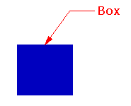
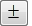
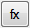

---
---

{: #kanchor1286}{: #kanchor1287}{: #kanchor1288}{: #kanchor1289}
# Leader
 [Where can I find this command?](javascript:void(0);) Toolbars
 [Dimension](dimension-toolbar.html)  [Drafting](drafting-toolbar.html) 
Menus
Dimension
Leader
The Leader command draws an annotation leader with arrowhead and attached text.

Steps
 [Pick](pick-location.html) the head of the leader.This is the arrow end.Pick the next points of the leader.Press [Enter](enter-key.html) to end the command. [Dimension Document Properties](dimensions.html) control the text height and arrow size.In the Leader text dialog box, type text for the leader.Leader Text
Text display
Type the leader text.

## Context Menu options
 [Right-click](right-mouse-click.html) in the text editing area to display the context menu.Undo
Undo typing.
Cut
Cut selected text to the Clipboard.
Copy
Copy selected text to the Clipboard.
Paste
Paste text from the Clipboard.
Delete
Delete selected text.
Select All
Selected all text in the edit window..
Set Edit Text Size
Sets the size for the text inside the edit box.
Degree
Enters a degree symbol (°) into the text.
Diameter
Enters a diameter symbol (Ø) into the text.
Plus/Minus
Enters a plus/minus symbol (±) into the text.
 [Text Field](text-fields.html) 
Text fields are formulas that are evaluated while Rhino is running and the result is displayed in the text.
{: #leader-properties}Leader Properties
Manages [object properties](properties.html) for the selected leaders.
Options
Text display
The current leader text.

## Context Menu options
 [Right-click](right-mouse-click.html) in the text editing area to display the context menu.Undo
Undo typing.
Cut
Cut selected text to the Clipboard.
Copy
Copy selected text to the Clipboard.
Paste
Paste text from the Clipboard.
Delete
Delete selected text.
Select All
Selected all text in the edit window..
Set Edit Text Size
Sets the size for the text inside the edit box.
Degree
Enters a degree symbol (°) into the text.
Diameter
Enters a diameter symbol (Ø) into the text.
Plus/Minus
Enters a plus/minus symbol (±) into the text.
 [Text Field](text-fields.html) 
Text fields are formulas that are evaluated while Rhino is running and the result is displayed in the text.
Style
Sets the [dimension style](dimensions-style.html).
 **Property Overrides** 
Replaces [style](dimensions-style.html) settings with specified settings for the selected [dimension](dimension.html) or [leader](#).
Save As New Style
Saves the changes made with Property Overrides as a new [dimension style](dimensions-style.html).
Edit Style
Opens [Dimension Style Document Properties](dimensions-style.html).
Match
Changes the leader properties to match a different leader.
See also
 [Use text and dimensions for annotation](sak-textanddimensions.html) 
&#160;
&#160;
Rhinoceros 6 © 2010-2015 Robert McNeel &amp; Associates.11-Nov-2015
 [Open topic with navigation](leader.html) 

