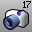
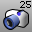
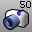
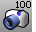
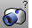

---
---

# Lens Length toolbar
{: #kanchor2343}
 [To open a toolbar](javascript:void(0);) Toolbars can be opened as a free-standing group or added to the current group.
To open a toolbar as a free-standing group
Click theOptionsicon in any toolbar group.On the menu, clickShow Toolbar, and then select the toolbar name from the list.To open a toolbar as a new tab in the current group
Click theOptionsicon in the toolbar group where you want to add the new tab.On the menu, clickShow or Hide Tabs, and then select the toolbar name from the list. [DollyZoom](dollyzoom.html) 
Move the camera location and change the lens length at the same time.
 [Viewport properties,Lens, Length](viewport.html#lens-length) 
Set the camera lens length to 17mm.
 [Viewport properties,Lens, Length](viewport.html#lens-length) 
Set the camera lens length to 25mm.
 [Viewport properties,Lens, Length](viewport.html#lens-length) 
Set the camera lens length to 50mm.
 [Viewport properties,Lens, Length](viewport.html#lens-length) 
Set the camera lens length to 100mm.
 [Viewport properties,Lens, Length](viewport.html#lens-length) 
Set the camera lens length to a custom length.
&#160;
&#160;
Rhinoceros 6 © 2010-2015 Robert McNeel &amp; Associates.11-Nov-2015
 [Open topic with navigation](lens-length-toolbar.html) 

