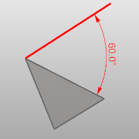
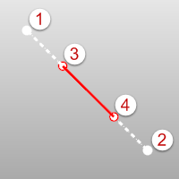
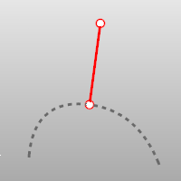
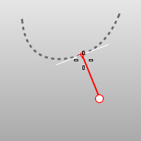
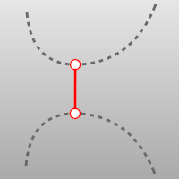
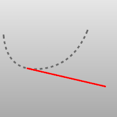
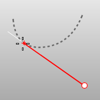
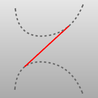
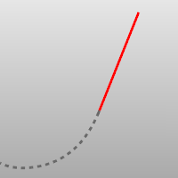

---
---

{: #kanchor1303}{: #kanchor1304}{: #kanchor1305}
# Line
 [Where can I find this command?](javascript:void(0);) Toolbars
 [Lines](lines-toolbar.html)  [Curve Drawing](curve-drawing-toolbar.html) 
Menus
Curve
Line
Single Line
Line Segments
Perpendicular from Curve
Perpendicular to 2 Curves
Tangent from Curve
Tangent to 2 Curves
Tangent, Perpendicular
Angled
Bisector
From 4 Points
Normal to Surface
Vertical to CPlane
The Line command draws one line segment.

Steps
 [Pick](pick-location.html) the start of the line.Pick the end of the line.Use object snaps to reference existing geometry.
Command-line options{: #line-bothsides}
BothSides
The BothSides option draws the object on both sides of the start point, creating the object twice as long as you indicate.

The BothSides option demonstrated with the [Line](#) command.
{: #normal}Normal
TheNormaloption draws the line normal to a location on a surface.

Normal steps
 [Select](select-objects.html) a surface. [Pick](pick-location.html) the start of the line on the surface.Pick the end of the line or type a length, and press [Enter](enter-key.html) .Normal option
IgnoreTrims
IfYes, surface trims are ignored. When the marker misses the untrimmed surface, the *no-access cursor* is shown.

No access cursor.
{: #angled}Angled
The Angled option draws the line at a specified angle from a reference line.

Angled steps
 [Pick](pick-location.html) the start of a base (reference) line.Pick the end of a base (reference) line.Type the pivot angle, and press [Enter](enter-key.html) .Pick the end of the line.{: #vertical}Vertical
The Vertical option draws the line vertical to the construction plane.

Vertical steps
 [Pick](pick-location.html) the start of the line.Pick the end of the line or type a length and press [Enter](enter-key.html) .{: #fourpoint}FourPoint
The FourPoint option draws the line using two points to establish direction and two points to establish length.

FourPoint steps
 [Pick](pick-location.html) the start of the base line (reference location).Pick the end of the base line (second reference location).Pick the start of the line.Pick the end of the line.{: #bisector}Bisector
The Bisector option draws the line that bisects a specified angle.

Bisector steps
 [Pick](pick-location.html) the start of the bisector line.Pick the start of the angle to bisect.Pick the end of the angle to bisect.Pick the end of the line or type a length, and press [Enter](enter-key.html) .{: #perpendicular}Perpendicular
The Perpendicular option draws the line perpendicular to or from a curve.

Perpendicular steps
 [Pick](pick-location.html) the start of the line on a curve.Pick the end of the line.Perpendicular options
Point
The Point option allows you to [pick](pick-location.html) a point that is near, but not on a curve, overriding the built-in object snap.

FromFirstPoint
The FromFirstPoint option forces the line to go through the first picked point on the curve instead of allowing the point to slide along the curve.
2Curves
The 2Curves option restricts the line to be perpendicular to two curves.

{: #tangent}Tangent
The Tangent option draws the line tangent from a curve.

Tangent steps
 [Pick](pick-location.html) the start of the line on a curve.Pick the end of the line.Tangent options
Point
The Point option allows you to [pick](pick-location.html) a point that is near, but not on a curve, overriding the built-in object snap.

FromFirstPoint
The FromFirstPoint option forces the line to go through the first picked point on the curve instead of allowing the point to slide along the curve.
2Curves
The 2Curves option restricts line to be tangent to two curves.

Extension
Extends a curve with a line.

Extension steps
 [Select](select-objects.html) a curve (line) near the end you want to extend.Pick the end of the line or type a distance and press [Enter](enter-key.html) .See also
 [Draw lines and curves](sak-curve.html) 
&#160;
&#160;
Rhinoceros 6 © 2010-2015 Robert McNeel &amp; Associates.11-Nov-2015
 [Open topic with navigation](line.html) 

