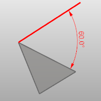
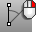
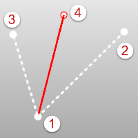
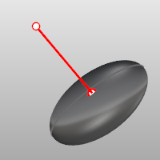
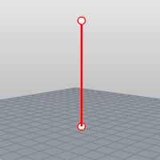
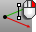

---
---

# Lines toolbar
{: #kanchor2346}
 [To open a toolbar](javascript:void(0);) Toolbars can be opened as a free-standing group or added to the current group.
To open a toolbar as a free-standing group
Click theOptionsicon in any toolbar group.On the menu, clickShow Toolbar, and then select the toolbar name from the list.To open a toolbar as a new tab in the current group
Click theOptionsicon in the toolbar group where you want to add the new tab.On the menu, clickShow or Hide Tabs, and then select the toolbar name from the list. [Convert](convert.html) 
Change a curve to polyline segments.
 [CurveThroughPt](curvethroughpt.html) 
Draw a polyline (degree 1 curve) through points.
 [Line](line.html) 
Draw a single line segment.
 [Lines](lines.html) 
Draw multiple adjoining line segments.
 [Line, *Angled* ](line.html#angled) 
Draw one angled line segment.
 [Line, *Angled, BothSides* ](line.html#angled) 
Draw one angled line segment from its midpoint.
 [Line, *Bisector* ](line.html#bisector) 
Draw one line segment at a bisecting angle.
 [Line, *Bisector, BothSides* ](line.html#bisector) 
Draw one line segment at a bisecting angle from its midpoint.
 [Line, *BothSides* ](line.html#line-bothsides) 
Draw one line segment from its midpoint.
 [Line, *FourPoint* ](line.html#fourpoint) 
Draw one line segment by four points.
 [Line, *FourPoint, BothSides* ](line.html#fourpoint) 
Draw one line segment by four points from its midpoint.
 [Line,](line.html#normal)  * [Normal](line.html#normal) * 
Draw a line segment normal to a surface.
 [Line,](line.html#normal)  * [Normal, BothSides](line.html#normal) * 
Draw a line segment normal to a surface from its midpoint.
 [Line, *Perpendicular, 2Curves* ](line.html#perpendicular) 
Draw one line segment perpendicular to two curves.
 [Line, *Perpendicular From* ](line.html#perpendicular) 
Draw a line segment perpendicular from a curve.
 [Line, *Perpendicular To* ](line.html#perpendicular) 
Draw a line segment perpendicular to a curve from its midpoint.
 [Line,Tangent, 2Curves](line.html#tangent) 
Draw one line segment tangent to two curves.
 [Line, *Tangent From* ](line.html#tangent) 
Draw a line segment tangent from a curve.
 [Line, *Tangent, Perpendicular* ](line.html#perpendicular) 
Draw one line segment tangent and perpendicular to curves.
 [LineThroughPt](linethroughpt.html) 
Fit a line through any combination of points, control points, and point-cloud objects.
 [Line,](line.html#vertical)  * [Vertical](line.html#vertical) * 
Draw a line segment perpendicular to the construction plane.
 [Line,](line.html#vertical)  * [Vertical, BothSides](line.html#vertical) * 
Draw a line segment perpendicular to the construction plane from its midpoint.
 [Polyline](polyline.html) 
Draw a multi-segment polyline with options for line and arc segments, tracking line helpers, and close.
 [PolylineOnMesh](polyline.html#polylineonmesh) 
Draw a multi-segment polyline on a mesh.
&#160;
&#160;
Rhinoceros 6 © 2010-2015 Robert McNeel &amp; Associates.11-Nov-2015
 [Open topic with navigation](lines-toolbar.html) 

