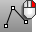

---
---

{: #kanchor1310}{: #kanchor1311}{: #kanchor1312}{: #kanchor1313}
# Lines
 [Where can I find this command?](javascript:void(0);) Toolbars
 [Lines](lines-toolbar.html)  [Main1](main1-toolbar.html)  [Curve Drawing](curve-drawing-toolbar.html) 
Menus
Curve
Line
Line Segments
The Lines command draw multiple adjoining line segments.
Use the [Polyline](polyline.html) command to create a single object made up of several straight or arc segments.
Steps
 [Pick](pick-location.html) the start of the first line segment.Pick the ends of the segments, and press [Enter](enter-key.html) .Your browser does not support the video tag.Command-line options
Close
Ends the line segment string at the beginning of the series.
Undo
The Undo option reverses the last action.
See also
 [Draw lines and curves](sak-curve.html) 
&#160;
&#160;
Rhinoceros 6 © 2010-2015 Robert McNeel &amp; Associates.11-Nov-2015
 [Open topic with navigation](lines.html) 

