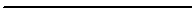
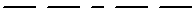
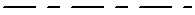
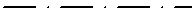
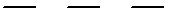
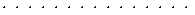
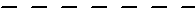

---
---

{: #kanchor1314}{: #kanchor1315}{: #kanchor1316}{: #kanchor1317}{: #kanchor1318}{: #kanchor1319}{: #kanchor1320}
# Linetypes
 [Where can I find this command?](javascript:void(0);) Toolbars
 [File](file-toolbar.html)  [Properties](properties-toolbar.html)  [Standard](standard-toolbar.html) 
Menus
File
Properties
The Linetype properties manage the linetype patterns for the current model.
Using linetypes displays curves using dashed or dotted.Linetypes are assigned as [object](properties.html#linetype) and [layer](layer.html#linetype) properties.Linetypes affect only curve objects - not surfaces, solids, or other object types.Options
Continuous

Border

Center

DashDot

Dashed

Dots

Hidden

Pattern
Linetypes are defined by a comma-separated list of dash and gap lengths (in model units), always starting with a dash. A zero-length dash is a dot.
Inches
Sets the display scale for linetypes to inches.
Millimeters
Sets the display scale for linetypes to millimeters.
 **Add** 
Adds a linetype definition.
 **Delete** 
Deletes a linetype definition.
{: #linetypedefinitionfile} **Import** 
Browse for any supported file type that could contain linetypes.
In the Import Linetypes dialog box, select the linetypes to import.
To set linetypes on objects
In [Object Properties](properties.html), underLinetypes, click an option.The default object linetype isBy Layer.To set linetypes on layers
In theLayerspanel, in theLinetypescolumn, select an option.OrUse theSetLayerLinetypecommand.To define linetypes
Use the controls to add a new type.To create a new linetype
Click **Add** .A new linetype is added to the list.Click the name to rename it.While the new linetype is active, in thePatternedit box specify the pattern for the linetype.Example
"1,1" specifies a pattern with a 1-unit dash, followed by a 1-unit space.
"2,.5" specifies a pattern with a 2-unit dash, followed by a 0.5-unit space.
"1,.25,.25,.25" specifies a pattern with a 1-unit dash, .25-unit space, .25-unit dash, .25-unit space.
Complex dash-space patterns can be created this way.
Linetype units
In Rhino linetype files, specify units with a designator. All subsequent line patterns will use the specified units. You can change back and forth within a single file. If neither designator is found, mm is used.
Example
#mm
Sets subsequent line patterns to mm units.
#inch
Sets subsequent line patterns to inch units.
To use linetypes defined in another Rhino model
In [Linetypes Document Properties](#), click **Import** to load linetype patterns from a Rhino file or an .lin file.Define linetypes in the [template](save.html#saveastemplate) files. [Copy](copytoclipboard.html) a line with the linetype definition and [paste](paste.html) it into your current model.Linetypes are stored in the [Rhino support folder](supportfilelocation.html) .Using AutoCAD linetype files
Copy your acad.lin file into the folder *C:/Users/&lt;loginname&gt;/AppData/Roaming/McNeel/Rhinoceros/5.0/Localization/en/Support.* 
Copy the contents of acad.lin and paste into the existing Rhino file.
# Related commands

## LinetypeDisplay
{: #linetypedisplay}
 [Where can I find this command?](javascript:void(0);) Toolbars
 [Not on toolbars.](toolbarwhattodo.html) 
Menus
 [Not on menus.](menuwhattodo.html) 
The LinetypeDisplay command displays curves using their [Linetype](properties.html#linetype) properties.
Command-line options
DisplayLinetypes
Displays curves using their [Linetype](properties.html#linetype) properties.
PatternBySegment
ThePatternBySegmentoption restarts the linetype pattern at the beginning of each polyline segment.
PatternSegmentBreakAngle
ThePatternSegmentBreakAngleoption restarts the linetype pattern when the angle between polyline segments exceeds this value.

## SetLinetype
{: #setlinetype}
 [Where can I find this command?](javascript:void(0);) Toolbars
 [Dimension](dimension-toolbar.html)  [Drafting](drafting-toolbar.html) 
Menus
 [Not on menus.](menuwhattodo.html) 
The SetLinetype command specifies a linetype for the selected curves.
Steps
 [Select](select-objects.html) curves.In theSelect Linetypesdialog box, select a linetype from the list.
## SetLayerLinetype
{: #setlayerlinetype}
 [Where can I find this command?](javascript:void(0);) Toolbars
 [Not on toolbars.](toolbarwhattodo.html) 
Menus
 [Not on menus.](menuwhattodo.html) 
The SetLayerLinetype command specifies a linetype for the specified layer.
Steps
Specify a layer name.Specify a linetype.
## SetLinetypeScale
{: #setlinetypescale}
 [Where can I find this command?](javascript:void(0);) Toolbars
 [Not on toolbars.](toolbarwhattodo.html) 
Menus
 [Not on menus.](menuwhattodo.html) 
The SetLinetypeScale command specifies the global linetype scale from the command line.
See also
 [Use drafting tools](sak-drafting.html) 
 [Manage document properties](sak-documentproperties.html) 
&#160;
&#160;
Rhinoceros 6 © 2010-2015 Robert McNeel &amp; Associates.11-Nov-2015
 [Open topic with navigation](linetypes.html) 

