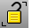

---
---

# Lock toolbar
{: #kanchor2347}
 [To open a toolbar](javascript:void(0);) Toolbars can be opened as a free-standing group or added to the current group.
To open a toolbar as a free-standing group
Click theOptionsicon in any toolbar group.On the menu, clickShow Toolbar, and then select the toolbar name from the list.To open a toolbar as a new tab in the current group
Click theOptionsicon in the toolbar group where you want to add the new tab.On the menu, clickShow or Hide Tabs, and then select the toolbar name from the list. [Invert](selection-commands.html#invert) and [Lock](lock.html) 
Deselect all selected objects and select all previously unselected objects and lock.
 [Lock](lock.html) 
Lock objects so they cannot be selected for editing.
 [Unlock](lock.html#unlock) 
Unlock all locked objects.
 [LockSwap](lock.html#lockswap) 
Lock all unlocked objects and unlock all previously locked objects.
 [Unlock](lock.html#unlock) 
Unlock all locked objects.
 [UnlockSelected](lock.html#unlockselected) 
Unlock selected locked objects.
&#160;
&#160;
Rhinoceros 6 © 2010-2015 Robert McNeel &amp; Associates.11-Nov-2015
 [Open topic with navigation](lock-toolbar.html) 

