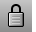
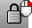
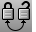

---
---

{: #kanchor1250}{: #kanchor1251}{: #kanchor1252}{: #kanchor1253}{: #kanchor1254}{: #kanchor1255}{: #kanchor1256}{: #kanchor1257}{: #kanchor1258}{: #kanchor1259}{: #kanchor1260}{: #kanchor1261}{: #kanchor1262}{: #kanchor1263}{: #kanchor1264}
# Lock
{: #top}
 [Where can I find this command?](javascript:void(0);) Toolbars
 [Lock](lock-toolbar.html)  [Popup](popup-toolbar.html)  [Standard](standard-toolbar.html)  [Visibility](visibility-toolbar.html) 
Menus
Edit
Visibility
Lock
Shortcut
 [Ctrl](ctrl-key.html) +L
The Lock command sets the state of selected objects so they can be seen and snapped to, but cannot be selected for editing.
Note
You cannot select locked objects.You can snap to locked objects.Use the [Layer](layer.html) dialog box to lock all objects on a layer.Steps
 [Select objects](select-objects.html) to lock, and press [Enter](enter-key.html) .Command line options
To access hidden command-line options
Type ahyphenin front of the command name:-Lock.Name of object set to lock
Enter the name of a set of objects to lock.

# Related commands

## Unlock
{: #unlock}
 [Where can I find this command?](javascript:void(0);) Toolbars
 [Lock](lock-toolbar.html)  [Visibility](visibility-toolbar.html) 
 [Standard](standard-toolbar.html) 
Menus
Edit
Visibility
Unlock
Shortcut
 [Ctrl](ctrl-key.html) + [Alt](alt-key.html) +L
The Unlock command unlocks all locked objects.
Command line options
To access command-line options
Type ahyphenin front of the command name:-Unlock.Name of object set to unlock
Enter the name of a set of locked objects.

## UnlockSelected
{: #unlockselected}
 [Where can I find this command?](javascript:void(0);) Toolbars
 [Lock](lock-toolbar.html)  [Visibility](visibility-toolbar.html) 
Menus
Edit
Visibility
Unlock Selected
Shortcut
 [Ctrl](ctrl-key.html) + [Shift](shift-key.html) +L
The UnlockSelected command unlocks selected locked objects.

## LockSwap
{: #lockswap}
 [Where can I find this command?](javascript:void(0);) Toolbars
 [Lock](lock-toolbar.html)  [Visibility](visibility-toolbar.html) 
Menus
Edit
Visibility
Swap Lock and Unlocked
The LockSwap command locks all unlocked objects and unlocks all previously locked objects.

## IsolateLock
{: #kanchor1266}
{: #kanchor1265}
{: #isolatelock}
 [Where can I find this command?](javascript:void(0);) Toolbars
 [Not on toolbars.](toolbarwhattodo.html) 
Menus
 [Not on menus.](menuwhattodo.html) 
The IsolateLock command locks all objects except the currently selected object.

## UnisolateLock
{: #kanchor1267}
{: #unisolatelock}
 [Where can I find this command?](javascript:void(0);) Toolbars
 [Not on toolbars.](toolbarwhattodo.html) 
Menus
 [Not on menus.](menuwhattodo.html) 
The UnisolateLock command unlocks all objects locked by the [IsolateLock](#isolatelock) command.
See also
 [Manage object visibility](sak-visibility.html) 
&#160;
&#160;
Rhinoceros 6 © 2010-2015 Robert McNeel &amp; Associates.11-Nov-2015
 [Open topic with navigation](lock.html) 

