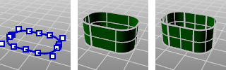

---
---

{: #kanchor1324}{: #kanchor1325}{: #kanchor1326}{: #kanchor1327}{: #kanchor1328}{: #kanchor1329}{: #kanchor1330}
# Loft
 [Where can I find this command?](javascript:void(0);) Toolbars
 [Surface Creation](surface-creation-toolbar.html)  [Surface Sidebar](surface-sidebar-toolbar.html) 
Menus
Surface
Loft
 [&#160;History enabled](historyenabled.html) 
&#160; [Crease splitting enabled](creasesplttingenabled.html) 
The Loft command fits a surface through selected profile curves that define the surface shape.
Steps
 [Select](select-objects.html) the curves in the order in which the surface should pass through them.Select open curves near the same ends. For closed curves, adjust the curve seams.To drag seams(closed cross-section curves only)
Select a seam point marker, and move it along the closed curve.Continue to adjust the seam points until they line with each other and the closed curves all have the same direction, and then press [Enter](enter-key.html) .Your browser does not support the video tag.Adjust seam options
Flip
Reverses the curve direction.
Automatic
Attempts to align the seam points and directions without intervention.
Natural
Moves the seam points to the way they were at the beginning of the command.
Command-line option
{: #point}Point
Allows picking a location for the start or end of the loft at a point. This tapers the loft to the selected point.
No point object is necessary, but it is a good idea to have some reference geometry in place to aid in picking the point location.
Point steps
At the start or the end of the loft, click the Point option. [Pick a location](pick-location.html) for the start or end location.Your browser does not support the video tag.Loft Options
Style
Determines the [knot](knot.html) and [control point](controlpoint.html) structure of the surface.
When some, but not all, endpoints of loft shapes touch, the loft type is restricted to Straight sections to avoid self-intersecting loops in the resulting surfaces.
Loose
The surface [control points](controlpoint.html) are created at the same locations as the control points of the original. This is a good option if the control points will be edited later.
Normal
The surface has an average amount of stretching between the curves. This is a good choice when the curves are proceeding in a relatively straight path or there is a lot of space between the curves.
Straight sections
Creates a ruled surface. The sections between the curves are straight.
Tight
The surface closely follows the original. This is a good choice when the input curves are going around a corner.
Uniform
Makes the object [knot vectors](knot.html) uniform.
Closed loft
Creates a closed surface, continuing the surface past the last curve and around to the first curve. Available when you have selected three shape curves.
Match start tangent
If the start curve is a surface edge, the lofted surface maintains tangency with the adjacent surface. You must use at least three curves to activate this option.
Match end tangent
If the end curve is a surface edge, maintains tangency with the adjacent surface. You must use at least three curves to activate this option.
SplitAtTangents
If checked, the loft creates a single surface.
If unchecked, the loft creates a polysurface when the input curves are joined tangent curves. Faces in the resulting polysurface correspond to the tangent sub-curves in the input curves.

Original polycurve (left), SplitAtTangents=No (center), SplitAtTangents=Yes (right).
Notes
When this option is used, the output will be a polysurface.When [UseExtrusions](useextrusions.html) is on, this setting has no effect.Cross-section curve options
 **Align Curves** 
Click the end of a shape curve to reverse the direction.
Your browser does not support the video tag.Do not simplify (A)
Curves will not be rebuilt.
Rebuild with ___ control points (B)
 [Rebuilds](rebuild.html) the shape curves before lofting.
Refit within ___&lt;units&gt;(C)
Refits the shape curves to the specified tolerance value.
See also
 [Create surfaces](sak-surface.html) 
&#160;
&#160;
Rhinoceros 6 © 2010-2015 Robert McNeel &amp; Associates.11-Nov-2015
 [Open topic with navigation](loft.html) 

