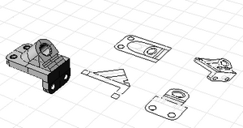
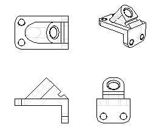
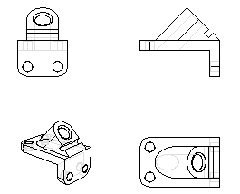

---
---

{: #kanchor1332}{: #kanchor1333}{: #kanchor1334}{: #kanchor1335}{: #kanchor1336}{: #kanchor1337}
# Make2D
 [Where can I find this command?](javascript:void(0);) Toolbars
 [Curve From Object](curve-from-object-toolbar.html)  [Drafting](drafting-toolbar.html)  [Dimension](dimension-toolbar.html) 
Menus
Dimension
Make 2-D Drawing
The Make2D command projects geometry to the construction plane to make a 2-D drawing.
TheMake2Dcommand creates curves from the selected [NURBS](http://www.rhino3d.com/nurbs) objects as silhouettes relative to the default construction planes. The silhouette curves are projected flat and then placed on the world xy&#160;plane.

Steps
 [Select](select-objects.html) the objects.Specify the layout and object visibility options.2-D Drawing Options
Drawing layout
Current View
Creates the 2-D drawing from only the currently active view.
Current CPlane
Creates the 2-D drawing from the plan view of the active viewport and the results are placed on that viewport's construction plane.
4-View (USA)

Creates four views with US (third angle) layout, using world-coordinate orthographic projections (not view or construction plane directions of current viewports).
4-View (Europe)

Creates four views with European (first angle) layout, using world-coordinate orthographic projections (not view or construction plane directions of current viewports).
Options
Show tangent edges
Draws tangent edges of polysurfaces.
Show hidden lines
Draws hidden lines on the Hidden layers specified.
Show viewport rectangle
Draws a rectangle representing the viewport edge. This applies only to perspective views.
Maintain source layers
The output is placed on a layer with the same name as the input geometry.
Otherwise, the output is placed on layers organized as sub-layers under the layers specified.
Layers for Make2D objects
Visible lines
Select a layer name for visible lines or type a new layer name.
Visible tangents
Select a layer name for visible tangent edges or type a new layer name.
Visible clipping planes
Select a layer name for visible clipping plane intersections or type a new layer name.
Hidden lines
Select a layer name for hidden lines or type a new layer name.
Hidden tangents
Select a layer name for hidden tangent edges or type a new layer name.
Hidden clipping planes
Select a layer name for hidden clipping plane intersections or type a new layer name.
Annotations
Select a layer name for dimensions or type a new layer name.
 **Restore Defaults** 
Resets layer names to default names.
Note
If two objects pass through each other, theMake2Dcommand will not create the intersection line where the objects intersect. Use the [Intersect](intersect.html) command to generate this curve and include it in the objects you want to make into a 2&#8209;D drawing.If silhouettes are nearly overlapping another curve in the view, they may not appear on the correct layer.While a single surface cylinder seam will not display, the two linear seams of a cylinder made out of two semi-cylinders will both display.See also
 [Use drafting tools](sak-drafting.html) 
&#160;
&#160;
Rhinoceros 6 © 2010-2015 Robert McNeel &amp; Associates.11-Nov-2015
 [Open topic with navigation](make2d.html) 

