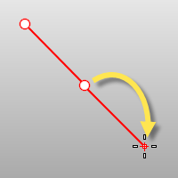

---
---

{: #kanchor1338}
# MakeHole
 [Where can I find this command?](javascript:void(0);) Toolbars
 [Holes](holes-toolbar.html)  [Solid Tools](solid-tools-toolbar.html) 
Menus
Solid
Solid Edit Tools
Holes
Make Hole
The MakeHole command projects selected closed curves to a surface or polysurface to define hole shapes.
Steps
 [Select](select-objects.html) closed curves.Select a surface or polysurface.Infinite Plane: TypeIPfor [InfinitePlane](infiniteplane.html) options.
 [Pick](pick-location.html) the cut depth point, or press [Enter](enter-key.html) to cut through object.Your browser does not support the video tag.Command-line options
Direction
X/Y/Z
Constrains the direction for the hole extrusion to x, y, or z.
Your browser does not support the video tag.NormalToCurve
Constrains the direction for the hole extrusion to the curve plane [normal](dir.html).
Your browser does not support the video tag.CPlaneNormal
Constrains the direction for the hole extrusion to the construction plane z&#160;direction.
Your browser does not support the video tag.Pick
Two points establish the direction angle.
Your browser does not support the video tag.Pick steps
 [Pick](pick-location.html) a base point.Pick a second point that establishes the direction angle.AlongCurve
Constrains the direction for the hole extrusion along a curve.
Your browser does not support the video tag.DeleteInput
Yes
Deletes the original geometry.
No
Retains the original geometry.
BothSides
The BothSides option draws the object on both sides of the start point, creating the object twice as long as you indicate.

See also
 [Create and edit holes in surfaces](sak-holes.html) 
&#160;
&#160;
Rhinoceros 6 © 2010-2015 Robert McNeel &amp; Associates.11-Nov-2015
 [Open topic with navigation](makehole.html) 

