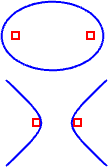
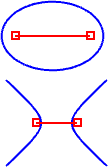

---
---

{: #kanchor1349}
# MarkFoci
 [Where can I find this command?](javascript:void(0);) Toolbars
 [Point](point-toolbar.html) 
Menus
Curve
Points
Mark Foci
The MarkFoci command places point objects at focus points of elliptic, hyperbolic, and parabolic curves.

Steps
 [Select](select-objects.html) a [conic](conic.html) curve.Command-line options
DrawAxis
Adds a line that links the foci of ellipses and hyperbolas and connects the parabola focus to the vertex.

See also
 [Analyze objects](sak-analysis.html) 
&#160;
&#160;
Rhinoceros 6 © 2010-2015 Robert McNeel &amp; Associates.11-Nov-2015
 [Open topic with navigation](markfoci.html) 

